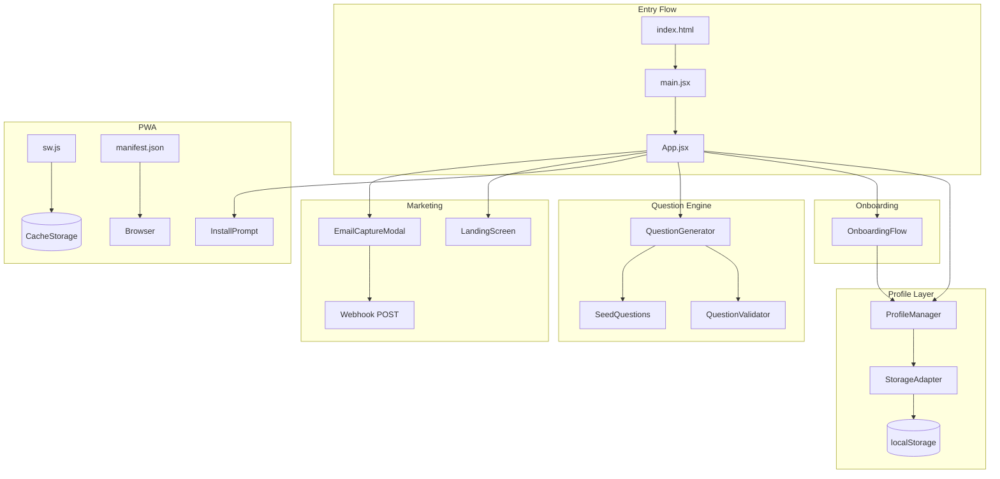

# Design Document: Commercial Launch Ready

## Overview

This design covers six feature areas required to make Algebra Assault commercially viable: multi-student profile management, procedural question generation, first-launch onboarding, PWA support (installable + offline), email capture with workbook download, and a landing screen. All features are client-side only, using the existing `window.storage` abstraction (localStorage polyfill) for persistence and React 18 with Vite 5 for rendering and bundling.

The design introduces new modules under `src/` that integrate with the existing screen-based architecture. No backend is required — the only network call is a fire-and-forget webhook POST for email capture.

## Architecture



### Key Architectural Decisions

1. **Storage Adapter pattern**: A new `StorageAdapter` module wraps `window.storage` and accepts a namespace prefix. All existing utilities (progressTracker, mistakeJournal, xpSystem, etc.) will receive the active profile's namespace prefix, replacing the hardcoded `"matteo-"` prefix.

2. **Profile Manager as singleton state**: Profile metadata lives in a single shared key (`algebra-assault-profiles`). The active profile ID is stored separately (`algebra-assault-active-profile`). All per-student keys are prefixed with the profile's derived namespace.

3. **Question Generator as pure functions**: The procedural generator is a set of pure functions that take a topic, difficulty, and optional random seed, returning question objects in the same shape as seed questions. This makes them testable without side effects.

4. **Service Worker with Vite plugin**: Use `vite-plugin-pwa` (Workbox-based) for service worker generation, precaching the app shell and bundled JS (which includes seed questions). Manual service worker code handles the update notification flow.

5. **Landing Screen in onboarding pipeline**: The landing screen slots into the existing disclaimer flow — it appears before the disclaimer on first visit, controlled by the same storage-flag pattern.

## Components and Interfaces

### ProfileManager (`src/utils/profileManager.js`)

```javascript
/**
 * @typedef {Object} Profile
 * @property {string} id - Unique namespace prefix (derived from name)
 * @property {string} name - Display name
 * @property {string} curriculum - 'caps' | 'ieb' | 'cambridge'
 * @property {string} createdAt - ISO date string
 */

// Core API
export function sanitizeName(name) → string | null
export function deriveNamespace(name) → string
export async function loadProfiles() → Profile[]
export async function createProfile(name, curriculum) → { success, profile?, error? }
export async function deleteProfile(id) → { success, error? }
export async function switchProfile(id) → { success, error? }
export async function getActiveProfile() → Profile | null
export async function setActiveProfile(id) → { success, error? }
export function getNamespacePrefix(profile) → string
export function hasNamespaceCollision(namespace, existingProfiles) → boolean
export function isProfileLimitReached(profiles) → boolean

// Constants
export const MAX_PROFILES = 10
export const MIN_PROFILES = 5  // minimum supported
export const PROFILES_KEY = 'algebra-assault-profiles'
export const ACTIVE_PROFILE_KEY = 'algebra-assault-active-profile'
```

### StorageAdapter (`src/utils/storageAdapter.js`)

```javascript
/**
 * Wraps window.storage with a namespace prefix.
 * All existing modules call through this instead of window.storage directly.
 */
export function createStorageAdapter(namespacePrefix) → {
  get(key) → Promise<{key, value} | null>,
  set(key, value) → Promise<{key, value} | null>,
  delete(key) → Promise<{key, deleted} | null>,
  list(prefix) → Promise<{keys} | null>,
  getFullKey(key) → string
}
```

### QuestionGenerator (`src/data/questionGenerator.js`)

```javascript
/**
 * @typedef {Object} GeneratedQuestion
 * @property {string} q - Question string
 * @property {string} a - Correct answer string
 * @property {string[]} wrong - Array of 3 distractor strings
 * @property {string} hint - Hint string
 * @property {string[]} steps - Step-by-step solution (2-6 steps)
 */

// Per-topic generators
export function generateLinear(difficulty) → GeneratedQuestion | null
export function generateQuadratic(difficulty) → GeneratedQuestion | null
export function generateExpExpr(difficulty) → GeneratedQuestion | null
export function generateExpEqn(difficulty) → GeneratedQuestion | null
export function generateInequality(difficulty) → GeneratedQuestion | null
export function generateSimultaneous(difficulty) → GeneratedQuestion | null

// Main entry point
export function generateQuestion(topic, difficulty) → GeneratedQuestion
export function generateQuestionPool(topic, difficulty, count) → GeneratedQuestion[]

// Distractor generation
export function generateDistractors(correctAnswer, topic, difficulty) → string[]

// Validation
export function validateQuestion(question) → boolean

// Constants
export const MAX_GENERATION_ATTEMPTS = 10
export const DIFFICULTY_RANGES = {
  easy: { min: 1, max: 9, integerOnly: true, positiveOnly: true },
  medium: { min: -99, max: 99, integerOnly: true, excludeRange: [-9, 9] },
  hard: { denominators: [2, 3, 4, 5, 6], minOps: 3 }
}
```

### OnboardingFlow (`src/screens/OnboardingScreen.jsx`)

```javascript
// React component
export function OnboardingScreen({ onComplete }) → JSX

// Validation helpers (exported for testing)
export function validateName(name) → { valid: boolean, error?: string }
export function validateCurriculum(curriculum) → { valid: boolean, error?: string }

// Name validation rules:
// - Trim leading/trailing whitespace
// - Min 1 char, max 20 chars (after trim)
// - Only letters (A-Z, a-z), hyphens, apostrophes, spaces
// - Must not be empty after trim
```

### LandingScreen (`src/screens/LandingScreen.jsx`)

```javascript
export function LandingScreen({ onContinue }) → JSX
// Displays value proposition, target audience, curricula, features
// Single CTA: "Start Playing" → advances to disclaimer
// No persistence — reappears every session until disclaimer is dismissed
```

### EmailCaptureModal (`src/components/EmailCaptureModal.jsx`)

```javascript
export function EmailCaptureModal({ onClose, profileNamespace }) → JSX

// Validation
export function validateEmail(email) → boolean
// Pattern: /^[^\s@]+@[^\s@]+\.[^\s@]+$/

// Constants
export const WEBHOOK_URL = 'https://hooks.example.com/algebra-assault-email' // configurable
export const WEBHOOK_TIMEOUT_MS = 10000
export const WORKBOOK_PATH = '/workbook.pdf'
```

### PWA Files

```
/public/manifest.json     - Web app manifest
/public/sw.js             - Service worker (or generated by vite-plugin-pwa)
/public/icons/            - App icons (192, 384, 512)
```

### Service Worker Strategy

```javascript
// Install: precache app shell (HTML, CSS, JS bundles, icons)
// Activate: clean old caches
// Fetch: cache-first for precached assets, network-first for dynamic
// Update: postMessage to client when new SW available
// Client: listen for 'SW_UPDATE_AVAILABLE' → show toast/banner
```

## Data Models

### Profile Storage Schema

```javascript
// Shared key: "algebra-assault-profiles"
[
  {
    "id": "sarah",              // derived namespace
    "name": "Sarah",            // display name
    "curriculum": "caps",       // caps | ieb | cambridge
    "createdAt": "2024-01-15T10:30:00.000Z"
  },
  {
    "id": "james-jr",
    "name": "James Jr",
    "curriculum": "ieb",
    "createdAt": "2024-01-16T08:00:00.000Z"
  }
]

// Active profile key: "algebra-assault-active-profile"
"sarah"  // stores the profile id (namespace)
```

### Per-Profile Storage Keys (namespaced)

```
{namespace}-progress-history     → JSON array of session records
{namespace}-mistakes             → JSON array of mistake entries
{namespace}-xp                   → JSON number
{namespace}-adaptive-state       → JSON object
{namespace}-daily-challenge      → JSON object
{namespace}-high-scores          → JSON array
{namespace}-completed-topics     → JSON object
{namespace}-workbook-downloaded  → "true" | absent
```

### Namespace Derivation Rules

```
Input: "Sarah"        → "sarah"
Input: "James Jr"     → "james-jr"
Input: "O'Brien"      → "obrien"
Input: "  Anna  "     → "anna"
Input: "Mary-Jane"    → "mary-jane"
Input: "123"          → "" (rejected: empty after removing non-alpha)
```

Wait — the requirement says "non-alphanumeric characters removed" but allows hyphens from whitespace replacement. Let me re-read: "lowercased, whitespace replaced with hyphens, non-alphanumeric characters removed". So the order is:
1. Lowercase
2. Replace whitespace with hyphens
3. Remove non-alphanumeric (keeping hyphens from step 2? No — hyphens are not alphanumeric)

Actually re-reading requirement 1.2: "lowercased, whitespace replaced with hyphens, non-alphanumeric characters removed". The hyphen from whitespace replacement should be kept. The intent is: lowercase → replace spaces with hyphens → remove everything that isn't a letter, digit, or hyphen. This preserves the word-boundary hyphens.

**Corrected derivation:**
1. Lowercase the input
2. Replace all whitespace characters with hyphens
3. Remove all characters that are not `[a-z0-9-]`
4. Collapse consecutive hyphens into one
5. Trim leading/trailing hyphens

```
Input: "James Jr"     → "james-jr"
Input: "O'Brien"      → "obrien"
Input: "Mary-Jane"    → "mary-jane"
Input: "  Hi There  " → "hi-there"
```

### Generated Question Shape

```javascript
{
  q: "3x + 7 = 22",           // question string
  a: "x = 5",                 // correct answer (formatted)
  wrong: ["x = 3", "x = 7", "x = 29"],  // 3 distractors
  hint: "Subtract 7, then divide by 3",
  steps: [
    "Subtract 7 from both sides → 3x = 15",
    "Divide both sides by 3 → x = 5"
  ]
}
```

### PWA Manifest Schema

```json
{
  "name": "Algebra Assault",
  "short_name": "AlgebraAssault",
  "start_url": "/",
  "display": "standalone",
  "theme_color": "#1e1b4b",
  "background_color": "#0f0a1e",
  "icons": [
    { "src": "/icons/icon-192.png", "sizes": "192x192", "type": "image/png" },
    { "src": "/icons/icon-384.png", "sizes": "384x384", "type": "image/png" },
    { "src": "/icons/icon-512.png", "sizes": "512x512", "type": "image/png" }
  ]
}
```

### Email Capture Webhook Payload

```json
{
  "email": "parent@example.com",
  "source": "algebra-assault",
  "timestamp": "2024-01-15T10:30:00.000Z"
}
```


## Correctness Properties

*A property is a characteristic or behavior that should hold true across all valid executions of a system — essentially, a formal statement about what the system should do. Properties serve as the bridge between human-readable specifications and machine-verifiable correctness guarantees.*

### Property 1: Namespace derivation is deterministic and well-formed

*For any* input string, the `deriveNamespace` function SHALL produce an output that is entirely lowercase, contains only characters matching `[a-z0-9-]`, contains no leading/trailing/consecutive hyphens, and is deterministic (same input always produces same output). Furthermore, *for any* two distinct input strings that produce the same namespace, `hasNamespaceCollision` SHALL return true.

**Validates: Requirements 1.2, 1.8**

### Property 2: Storage key prefixing

*For any* namespace prefix and any storage key, the `StorageAdapter` SHALL produce a full key equal to `{namespace}-{key}`, and reading/writing through the adapter SHALL always use this prefixed key in the underlying storage.

**Validates: Requirements 1.4**

### Property 3: Profile deletion removes all namespaced keys

*For any* profile with a set of associated storage keys, after deletion, the underlying storage SHALL contain none of the keys that were prefixed with that profile's namespace, and the profiles list SHALL not contain an entry with that profile's id.

**Validates: Requirements 1.6**

### Property 4: Storage failure preserves existing state

*For any* valid initial profile state and any profile operation (create, switch, delete) that encounters a storage failure, the profiles list and all existing namespaced keys SHALL remain unchanged after the failed operation.

**Validates: Requirements 1.10**

### Property 5: Question round-trip correctness

*For any* generated question (across all topics and difficulties), independently solving the equation in the `q` field SHALL yield a result equivalent to the value in the `a` field.

**Validates: Requirements 2.3, 2.8**

### Property 6: Generated question structural validity

*For any* generated question, the output object SHALL have: exactly 3 elements in the `wrong` array that are all distinct from each other and from the `a` field; a `steps` array with length between 2 and 6 inclusive; and all required properties (`q`, `a`, `wrong`, `hint`, `steps`) with correct types (strings and string arrays).

**Validates: Requirements 2.4, 2.5, 2.6**

### Property 7: Coefficient range compliance

*For any* generated question at "easy" difficulty, all numerical coefficients SHALL be positive integers from 1 to 9. *For any* generated question at "medium" difficulty, all coefficients SHALL be integers in [-99, -10] ∪ [10, 99]. *For any* generated question at "hard" difficulty, fractional coefficients SHALL have denominators from 2 to 6.

**Validates: Requirements 2.2**

### Property 8: Question pool composition

*For any* call to `generateQuestionPool(topic, difficulty, count)` where count ≥ 4, the returned pool SHALL contain at least 70% generated questions (non-seed questions).

**Validates: Requirements 2.7**

### Property 9: Answer format compliance

*For any* generated question, the answer string SHALL match the formatting convention for its topic: linear/exponential equations use "x = [value]", quadratic equations with two solutions use "x = [v1] or [v2]", equations with ± solutions use "x = ±[value]", and simultaneous equations use "([x], [y])".

**Validates: Requirements 2.10**

### Property 10: Name validation correctness

*For any* string, the `validateName` function SHALL return valid=true if and only if the trimmed string has length between 1 and 20 inclusive and contains only characters matching `[A-Za-z '-]`.

**Validates: Requirements 3.2**

### Property 11: Subtitle personalization

*For any* valid profile name, the menu subtitle SHALL equal the name converted to uppercase followed by the literal string "'S MATH MISSION".

**Validates: Requirements 3.5**

### Property 12: Email validation correctness

*For any* string, the `validateEmail` function SHALL return true if and only if the string matches the pattern `^[^\s@]+@[^\s@]+\.[^\s@]+$`.

**Validates: Requirements 5.3**

## Error Handling

### Storage Failures

| Operation | Failure Mode | Behavior |
|-----------|-------------|----------|
| Profile creation | `window.storage.set` throws/returns null | Display error message, preserve form input, do not add partial profile to list |
| Profile deletion | `window.storage.delete` throws | Display error message, do not remove profile from list (atomic: all-or-nothing) |
| Profile switch | `window.storage.get` fails for new profile data | Display error message, remain on current profile |
| Profile load on launch | `window.storage.get` fails for active profile key | Show profile selection screen (treat as no active profile) |
| Question generation | Coefficient yields invalid answer | Retry up to 10 times, then fall back to random seed question |

### Network Failures (Email Capture)

| Scenario | Behavior |
|----------|----------|
| Webhook POST fails (network error) | Silently ignore, still show download link |
| Webhook POST times out (>10s) | Abort request, still show download link |
| Webhook URL misconfigured | Same as network error — fire-and-forget |

### PWA/Service Worker Failures

| Scenario | Behavior |
|----------|----------|
| Browser doesn't support SW | Skip registration silently, app works as standard web app |
| Cache storage quota exceeded | Continue with already-cached assets, fall back to network |
| SW update fails to install | Keep current SW active, retry on next page load |

### Input Validation Errors

| Input | Validation | Error Message |
|-------|-----------|---------------|
| Profile name empty/whitespace | Reject | "Please enter a name" |
| Profile name >30 chars | Reject | "Name must be 30 characters or fewer" |
| Profile name → empty namespace | Reject | "Name must contain at least one letter or number" |
| Namespace collision | Reject | "A profile with this name already exists" |
| Profile limit reached (10) | Disable create button | "Maximum of 10 profiles reached" |
| Onboarding name empty | Reject | "Please enter your name" |
| Onboarding name invalid chars | Reject | "Name can only contain letters, hyphens, apostrophes, and spaces" |
| Onboarding no curriculum | Reject | "Please select a curriculum" |
| Email empty/invalid | Reject | "Please enter a valid email address" |

## Testing Strategy

### Test Framework

- **Unit/Property tests**: Vitest (already configured) + fast-check (already installed)
- **Component tests**: @testing-library/react (already installed)
- **No E2E framework** — manual testing for PWA install flow and offline behavior

### Property-Based Tests (fast-check)

Each correctness property maps to a single property-based test with minimum 100 iterations:

| Property | Test File | What's Generated |
|----------|-----------|-----------------|
| 1: Namespace derivation | `src/utils/profileManager.test.js` | Random strings (unicode, whitespace, special chars) |
| 2: Storage key prefixing | `src/utils/storageAdapter.test.js` | Random namespace prefixes + random key names |
| 3: Profile deletion cleanup | `src/utils/profileManager.test.js` | Random profiles with random sets of namespaced keys |
| 4: Storage failure safety | `src/utils/profileManager.test.js` | Random initial states + simulated failures |
| 5: Question round-trip | `src/data/questionGenerator.test.js` | Generated questions across all topics/difficulties |
| 6: Question structure | `src/data/questionGenerator.test.js` | Generated questions (random topic + difficulty) |
| 7: Coefficient ranges | `src/data/questionGenerator.test.js` | Generated questions per difficulty tier |
| 8: Pool composition | `src/data/questionGenerator.test.js` | Random pool sizes (4-50) across topics |
| 9: Answer format | `src/data/questionGenerator.test.js` | Generated questions per topic type |
| 10: Name validation | `src/screens/OnboardingScreen.test.js` | Random strings (valid and invalid) |
| 11: Subtitle personalization | `src/screens/MenuScreen.test.js` | Random valid profile names |
| 12: Email validation | `src/components/EmailCaptureModal.test.js` | Random strings + structured email-like strings |

**Configuration**: Each property test runs with `{ numRuns: 100 }` minimum.

**Tag format**: Each test includes a comment: `// Feature: commercial-launch-ready, Property {N}: {title}`

### Unit Tests (Example-Based)

| Area | Test File | Key Examples |
|------|-----------|-------------|
| Profile CRUD | `src/utils/profileManager.test.js` | Create, read, update, delete happy paths |
| Onboarding flow | `src/screens/OnboardingScreen.test.js` | Valid submission, curriculum selection |
| Landing screen | `src/screens/LandingScreen.test.js` | Content presence, CTA navigation |
| Email modal | `src/components/EmailCaptureModal.test.js` | Open/close, submit flow, download link |
| PWA manifest | `public/manifest.test.js` | Required fields present |
| Question fallback | `src/data/questionGenerator.test.js` | 10 failed attempts → seed question |

### Integration Tests

| Scenario | Approach |
|----------|----------|
| Profile switch reloads state | Mock storage with two profiles, switch, verify all modules read from new namespace |
| Onboarding → profile creation → menu | Render App, complete onboarding, verify menu shows personalized subtitle |
| Offline gameplay | Manual testing (Service Worker + cache verification) |

### What Is NOT Tested with PBT

- PWA/Service Worker behavior (infrastructure, not pure logic)
- UI rendering and layout (use component tests with @testing-library/react)
- Landing screen content (static, example-based)
- Webhook POST behavior (side-effect, mock-based)
