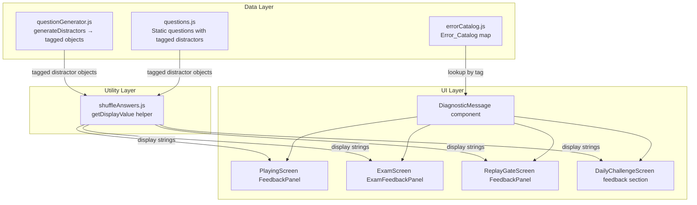
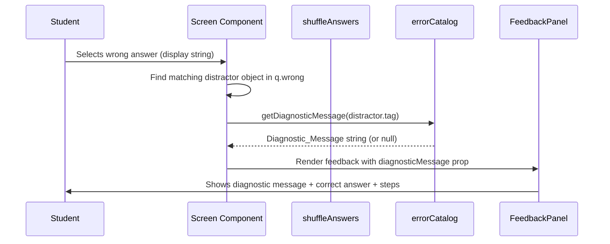

# Design Document: Error Diagnosis Feedback

## Overview

This feature adds targeted diagnostic feedback to Algebra Assault so that when a student picks a wrong answer, they see a short plain-language message explaining the specific algebraic mistake they made. The system maps each distractor (wrong answer) to an Error_Tag, and each Error_Tag maps to a student-facing Diagnostic_Message via a centralized Error_Catalog.

The design touches three layers:
1. **Data layer** — a new `errorCatalog.js` module and modifications to `questionGenerator.js` and `questions.js` to tag distractors.
2. **Utility layer** — updates to `shuffleAnswers.js` to handle the new object-format distractors.
3. **UI layer** — a shared `DiagnosticMessage` component rendered inside the existing feedback panels of PlayingScreen, ExamScreen, ReplayGateScreen, and DailyChallengeScreen.

### Design Decisions

| Decision | Rationale |
|----------|-----------|
| Centralized Error_Catalog as a standalone module | Single source of truth; easy to update messages without touching question logic |
| Distractor objects `{ value, tag }` instead of plain strings | Carries metadata alongside display text; backward-compatible via a helper |
| Helper function `getDisplayValue(distractor)` | Encapsulates the string-or-object check in one place for all consumers |
| Shared `DiagnosticMessage` component | Avoids duplicating feedback UI across four screens |
| Graceful fallback when tag is missing/unknown | Ensures the game never crashes; simply omits the diagnostic section |

## Architecture



### Data Flow (Wrong Answer)



## Components and Interfaces

### 1. Error Catalog Module (`src/data/errorCatalog.js`)

```js
/**
 * @typedef {Object} ErrorEntry
 * @property {string} tag - Unique Error_Tag identifier
 * @property {string} message - Student-facing diagnostic message
 */

/**
 * ERROR_CATALOG - Map<string, string>
 * Keys: Error_Tag strings
 * Values: Diagnostic_Message strings
 */
export const ERROR_CATALOG = {
  // Inequalities
  sign_flip_forgotten: "You forgot to flip the inequality sign when dividing by a negative.",
  // Quadratics
  single_root_only: "You only found one solution — quadratics can have two roots.",
  // Exponent expressions
  exponents_added_not_multiplied: "You added the exponents instead of multiplying them. Power-of-a-power means multiply.",
  exponents_multiplied_not_added: "You multiplied the exponents instead of adding them. Same-base multiplication means add.",
  // General
  sign_error: "You made a sign mistake — check where negatives appear in each step.",
  exponent_add: "You added the exponents when you should have multiplied them.",
  exponent_multiply: "You multiplied the exponents when you should have added them.",
  off_by_one: "Your answer is off by one — double-check your arithmetic in the last step.",
  forgot_flip: "You forgot to flip the inequality sign when dividing by a negative number.",
  swapped_variables: "You swapped the x and y values — check which variable is which.",
  arithmetic_error: "You made an arithmetic mistake with the numbers — recheck your calculations.",
  general_miscalculation: "That's not quite right — try working through each step again carefully.",
  // ... additional per-topic tags (3-10 per topic)
};

/**
 * Look up a diagnostic message by Error_Tag.
 * @param {string|null|undefined} tag
 * @returns {string|null} The message, or null if tag is missing/unknown
 */
export function getDiagnosticMessage(tag) {
  if (!tag) return null;
  return ERROR_CATALOG[tag] ?? null;
}
```

### 2. Distractor Display Helper (`src/utils/shuffleAnswers.js` — extended)

```js
/**
 * Extracts the display string from a distractor entry.
 * Supports both legacy plain-string format and new object format.
 * @param {string|{value: string, tag?: string}} distractor
 * @returns {string}
 */
export function getDisplayValue(distractor) {
  if (distractor === null || distractor === undefined) return '';
  if (typeof distractor === 'string') return distractor;
  if (typeof distractor === 'object' && distractor !== null) {
    const val = distractor.value;
    if (val === null || val === undefined) return '';
    return String(val);
  }
  return String(distractor);
}
```

The existing `shuffleAnswers` function will be updated to call `getDisplayValue` internally when computing the seed hash, and the screens will use `getDisplayValue` when rendering answer buttons and comparing selections.

### 3. Tagged Distractor Format

Generated and static distractors will use this shape:

```js
{ value: "x = 5", tag: "sign_error" }
```

The `wrong` array in a question object becomes:
```js
wrong: [
  { value: "x = 5", tag: "sign_error" },
  { value: "x = −3", tag: "off_by_one" },
  { value: "x = 9", tag: "general_miscalculation" }
]
```

### 4. DiagnosticMessage Component (`src/components/DiagnosticMessage.jsx`)

```jsx
/**
 * Renders a diagnostic feedback message for a wrong answer.
 * @param {{ message: string }} props
 * @returns {JSX.Element|null}
 */
export function DiagnosticMessage({ message }) {
  if (!message) return null;
  return (
    <div className="flex items-start gap-2 bg-amber-500/20 border border-amber-400/40 rounded-xl px-3 py-2 mb-3">
      <span className="text-lg flex-shrink-0">💡</span>
      <p className="text-sm sm:text-base text-amber-100 font-medium leading-snug">
        {message}
      </p>
    </div>
  );
}
```

### 5. Screen Integration Interface

Each feedback panel receives a new optional prop:

```js
// In PlayingScreen, ExamScreen, ReplayGateScreen, DailyChallengeScreen
<FeedbackPanel
  feedback={feedback}
  question={q}
  diagnosticMessage={diagnosticMessage}  // string | null
  onDismiss={onDismissTeachMe}
/>
```

The parent screen computes `diagnosticMessage` by:
1. Finding the selected distractor object in `q.wrong` whose `getDisplayValue(d)` matches the selected answer string.
2. Calling `getDiagnosticMessage(distractor.tag)`.

### 6. Updated `generateDistractors` Signature

```js
/**
 * @param {string} correctAnswer
 * @param {string} topic
 * @param {string} difficulty
 * @returns {Array<{value: string, tag: string}>} Array of 3 tagged distractor objects
 */
export function generateDistractors(correctAnswer, topic, difficulty) { ... }
```

## Data Models

### Error Catalog Entry

| Field | Type | Constraints |
|-------|------|-------------|
| tag | `string` | Unique across entire catalog; snake_case; describes the misconception |
| message | `string` | 8–30 words; second-person; Grade 10 vocabulary |

### Tagged Distractor Object

| Field | Type | Constraints |
|-------|------|-------------|
| value | `string` | The display text of the wrong answer |
| tag | `string` | Must reference a key in ERROR_CATALOG; defaults to `"general_miscalculation"` |

### Question Object (updated)

```js
{
  q: string,           // Question text
  a: string,           // Correct answer
  wrong: Array<string | {value: string, tag: string}>,  // Backward-compatible
  hint: string,        // Optional hint
  steps: string[]      // Solution steps
}
```

### Error Tags by Topic (minimum set)

| Topic | Error_Tags |
|-------|-----------|
| Linear Equations | `sign_error`, `arithmetic_error`, `off_by_one`, `general_miscalculation` |
| Quadratic Equations | `single_root_only`, `sign_error`, `arithmetic_error`, `general_miscalculation` |
| Exponential Expressions | `exponents_added_not_multiplied`, `exponents_multiplied_not_added`, `arithmetic_error`, `general_miscalculation` |
| Exponential Equations | `exponent_add`, `exponent_multiply`, `arithmetic_error`, `general_miscalculation` |
| Inequalities | `sign_flip_forgotten`, `forgot_flip`, `sign_error`, `arithmetic_error`, `general_miscalculation` |
| Simultaneous Equations | `swapped_variables`, `sign_error`, `arithmetic_error`, `general_miscalculation` |

