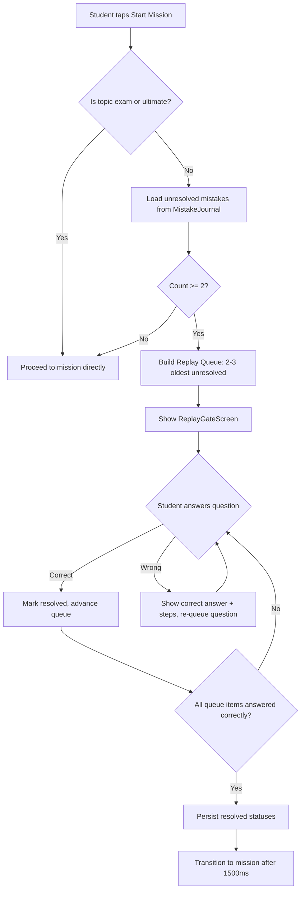

# Design Document: Forced Mistake Replay

## Overview

The Forced Mistake Replay feature introduces a spaced repetition gate into the mission start flow. When a student taps "Start Mission" on the TopicSelectScreen, the system checks for unresolved mistakes in the Mistake Journal. If 2 or more unresolved mistakes exist, the student must correctly answer 2–3 of those questions before the mission begins.

This design integrates into the existing architecture by:
- Adding a new `ReplayGateScreen` React component in `src/screens/`
- Adding a pure-logic module `src/utils/replayGate.js` for queue selection and gate evaluation
- Intercepting the `startMission` flow in `useGameState.js` with an async check before transitioning to the `'playing'` screen

The gate is bypassed for Exam Simulator and Ultimate Challenge modes.

### Design Rationale

- **Separation of concerns**: Gate logic (should we show replay? which questions?) is a pure module, testable without React. The screen component handles only presentation.
- **Minimal disruption**: The replay screen reuses the same visual patterns as the in-game question overlay and ReviewScreen, keeping the experience cohesive.
- **Graceful degradation**: If localStorage fails during persistence of resolved status, the mission proceeds anyway (requirement 6.3).

## Architecture



### Screen State Integration

The feature adds a new screen state `'replayGate'` to the existing screen routing in `App.jsx`. The flow becomes:

1. `TopicSelectScreen` calls `startMission(topic)`
2. `startMission` checks the gate condition
3. If gate activates: `setScreen('replayGate')` with pending topic stored in state
4. On replay completion: original `startMission` logic executes with the stored topic

## Components and Interfaces

### 1. `src/utils/replayGate.js` — Pure Logic Module

```javascript
/**
 * Determines whether the replay gate should activate.
 * @param {Array} mistakes - All mistake entries from MistakeJournal
 * @param {string} topic - The topic being started
 * @returns {{ shouldActivate: boolean, queue: Array }}
 */
export function evaluateGate(mistakes, topic) { ... }

/**
 * Selects 2-3 oldest unresolved mistakes for the replay queue.
 * @param {Array} unresolvedMistakes - Filtered unresolved entries
 * @returns {Array} Ordered queue of 2-3 mistake entries
 */
export function buildReplayQueue(unresolvedMistakes) { ... }

/**
 * Determines if a topic is excluded from the replay gate.
 * @param {string} topic - Topic key
 * @returns {boolean} True if excluded (exam, ultimate)
 */
export function isExcludedTopic(topic) { ... }
```

**Rules:**
- `isExcludedTopic` returns `true` for `'exam'` and `'ultimate'`
- `evaluateGate` filters mistakes to only unresolved (`resolved === false`), checks count >= 2, and calls `buildReplayQueue`
- `buildReplayQueue` sorts by `timestamp` ascending (oldest first), returns the first `Math.min(3, unresolvedMistakes.length)` entries (minimum 2)

### 2. `src/screens/ReplayGateScreen.jsx` — UI Component

```javascript
/**
 * Props:
 *   queue        - Array of mistake entries to replay
 *   onComplete   - Callback when all questions answered correctly
 *   soundOn      - Boolean for sound effects
 */
export function ReplayGateScreen({ queue, onComplete, soundOn }) { ... }
```

**Internal State:**
- `currentIndex` — index into the active queue
- `activeQueue` — mutable copy of queue (items re-appended on wrong answer)
- `feedback` — current feedback state (`null | { type: 'correct'|'wrong', ... }`)
- `resolvedTimestamps` — Set of `{topic, timestamp}` pairs answered correctly

**Behavior:**
- Displays questions one at a time in the same multiple-choice format as `PlayingScreen`
- Uses `shuffleAnswers` for option ordering
- On correct: shows green feedback, advances after 1200ms
- On wrong: shows correct answer + solution steps, re-appends question to end of `activeQueue`, advances after 2000ms
- When all unique questions answered correctly: calls `onComplete(resolvedTimestamps)` after 1500ms transition delay

### 3. Integration in `useGameState.js`

```javascript
// New state
const [pendingTopic, setPendingTopic] = useState(null);

// Modified startMission
const startMission = async (t) => {
  if (t === 'exam') { startExam(); return; }
  if (isExcludedTopic(t)) { /* proceed directly */ }
  
  const allMistakes = await loadMistakes();
  const { shouldActivate, queue } = evaluateGate(allMistakes, t);
  
  if (shouldActivate) {
    setPendingTopic(t);
    setReplayQueue(queue);
    setScreen('replayGate');
    return;
  }
  
  // Original mission start logic...
};

// New handler for replay completion
const handleReplayComplete = async (resolvedItems) => {
  // Persist resolved status (fire-and-forget on failure)
  for (const { topic, timestamp } of resolvedItems) {
    await markResolved(topic, timestamp).catch(() => {});
  }
  // Reload mistakes state
  const updated = await loadMistakes();
  setMistakes(updated);
  // Start the originally requested mission
  startMissionDirect(pendingTopic);
};
```

### 4. Integration in `App.jsx`

```javascript
if (screen === 'replayGate') {
  return (
    <ReplayGateScreen
      queue={replayQueue}
      onComplete={handleReplayComplete}
      soundOn={soundOn}
    />
  );
}
```

## Data Models

### Existing: MistakeEntry (from mistakeJournal.js)

```javascript
{
  topic: string,          // e.g. 'linear', 'quadratic'
  question: {             // Full question object
    q: string,            // Question text
    a: string,            // Correct answer
    wrong: string[],      // Array of 3 wrong answers
    hint: string,         // Hint text
    steps: string[]       // Solution steps array
  },
  selectedAnswer: string, // What the student chose
  correctAnswer: string,  // The correct answer string
  timestamp: number,      // Date.now() when mistake was made
  resolved: boolean       // false = unresolved, true = resolved
}
```

### New: ReplayQueueItem (runtime only, not persisted)

```javascript
{
  // Spread from MistakeEntry, plus:
  _requeued: boolean      // Internal flag: true if this was re-appended after wrong answer
}
```

### State additions to useGameState

```javascript
const [pendingTopic, setPendingTopic] = useState(null);   // Topic waiting behind gate
const [replayQueue, setReplayQueue] = useState([]);       // Queue for ReplayGateScreen
```

No new localStorage keys are introduced. The feature uses the existing `{prefix}-mistakes` key via the MistakeJournal API.

## Correctness Properties

*A property is a characteristic or behavior that should hold true across all valid executions of a system — essentially, a formal statement about what the system should do. Properties serve as the bridge between human-readable specifications and machine-verifiable correctness guarantees.*

### Property 1: Gate activation threshold

*For any* array of mistake entries (with any mix of resolved and unresolved flags), `evaluateGate` SHALL return `shouldActivate === true` if and only if the number of entries where `resolved === false` is greater than or equal to 2.

**Validates: Requirements 1.1, 1.2, 1.3**

### Property 2: Queue length invariant

*For any* array of unresolved mistake entries with length >= 2, `buildReplayQueue` SHALL return a queue with length between 2 and 3 inclusive (specifically: `min(3, unresolvedCount)`).

**Validates: Requirements 2.1**

### Property 3: Oldest-first selection

*For any* array of unresolved mistake entries with length > 3, every entry in the returned queue SHALL have a timestamp less than or equal to every entry NOT in the queue. That is, the queue contains the entries with the smallest timestamps.

**Validates: Requirements 2.2**

### Property 4: Excluded topics always bypass gate

*For any* array of mistake entries (including arrays with many unresolved entries), when the topic is `'exam'` or `'ultimate'`, `evaluateGate` SHALL return `shouldActivate === false`.

**Validates: Requirements 7.1, 7.2**

### Property 5: Re-queue guarantees all-correct termination

*For any* initial replay queue and any sequence of answers (where each wrong answer causes the question to be re-appended), the session SHALL terminate only when every unique question in the original queue has been answered correctly at least once. Equivalently: after any sequence of interactions that ends the session, the set of correctly-answered questions equals the set of original queue questions.

**Validates: Requirements 5.3, 5.4**

### Property 6: Completion resolves exactly the queued items

*For any* replay queue, when the session completes (all questions answered correctly), the set of items marked for resolution SHALL be exactly the set of unique `{topic, timestamp}` pairs from the original queue — no more, no less.

**Validates: Requirements 4.2**

## Error Handling

| Scenario | Behavior | Rationale |
|----------|----------|-----------|
| `loadMistakes()` fails (storage unavailable) | Returns `[]`, gate does not activate, mission proceeds | Non-blocking: student shouldn't be stuck if storage is broken |
| `markResolved()` fails during completion | Mission proceeds anyway; mistake remains unresolved for next session | Requirement 6.3: persistence failure is non-critical |
| Question object missing `steps` field | Replay screen shows correct answer only, omits steps section | Graceful degradation for older mistake entries |
| Question object missing `wrong` field | Skip that entry in queue building (treat as invalid) | Defensive: corrupted data shouldn't crash the gate |
| Replay queue becomes empty unexpectedly | Call `onComplete` immediately (no questions to answer) | Edge case: shouldn't block mission start |

### Error Boundaries

The `ReplayGateScreen` component should be wrapped in a try/catch at the render level. If the component throws during render (e.g., malformed question data), the parent should catch and proceed directly to the mission — the gate should never permanently block gameplay.

## Testing Strategy

### Unit Tests (Example-Based)

| Test | Validates |
|------|-----------|
| `evaluateGate` returns `shouldActivate: false` when 0 unresolved mistakes | Req 1.3 |
| `evaluateGate` returns `shouldActivate: false` when 1 unresolved mistake | Req 1.3 |
| `evaluateGate` returns `shouldActivate: true` when exactly 2 unresolved | Req 1.2 |
| `buildReplayQueue` returns 2 items when given exactly 2 unresolved | Req 2.1 |
| `buildReplayQueue` returns 3 items when given 5 unresolved | Req 2.1 |
| `isExcludedTopic('exam')` returns true | Req 7.1 |
| `isExcludedTopic('ultimate')` returns true | Req 7.2 |
| `isExcludedTopic('linear')` returns false | Req 7.1/7.2 inverse |
| ReplayGateScreen renders progress indicator "Question 1 of 3" | Req 3.2 |
| ReplayGateScreen renders "Quick Review" header | Req 3.3 |
| ReplayGateScreen shows correct answer on wrong selection | Req 5.1 |
| ReplayGateScreen shows solution steps on wrong selection | Req 5.2 |
| ReplayGateScreen calls onComplete after all correct | Req 4.3 |
| Mission proceeds when markResolved throws | Req 6.3 |

### Property-Based Tests

**Library**: [fast-check](https://github.com/dubzzz/fast-check) (JavaScript PBT library)

Each property test runs a minimum of 100 iterations with randomly generated inputs.

| Property Test | Tag |
|---------------|-----|
| Gate activation threshold | Feature: forced-mistake-replay, Property 1: Gate activation threshold |
| Queue length invariant | Feature: forced-mistake-replay, Property 2: Queue length invariant |
| Oldest-first selection | Feature: forced-mistake-replay, Property 3: Oldest-first selection |
| Excluded topics bypass | Feature: forced-mistake-replay, Property 4: Excluded topics always bypass gate |
| Re-queue termination | Feature: forced-mistake-replay, Property 5: Re-queue guarantees all-correct termination |
| Completion resolves queue | Feature: forced-mistake-replay, Property 6: Completion resolves exactly the queued items |

### Test Generator Strategy

For property tests, generate:
- **Mistake entries**: Random objects with `{ topic: randomTopic, question: { q, a, wrong: [3 strings], hint, steps }, selectedAnswer, correctAnswer, timestamp: randomInt, resolved: randomBool }`
- **Answer sequences**: Random arrays of correct/incorrect choices to simulate user interaction with the replay queue
- **Topic strings**: Mix of valid playable topics, 'exam', 'ultimate', and arbitrary strings

### Integration Tests

| Test | Validates |
|------|-----------|
| Full flow: startMission → gate activates → replay completes → mission starts | End-to-end flow |
| Full flow: startMission with < 2 unresolved → mission starts directly | Gate bypass |
| Resolved status persists to localStorage after replay completion | Req 6.2 |

