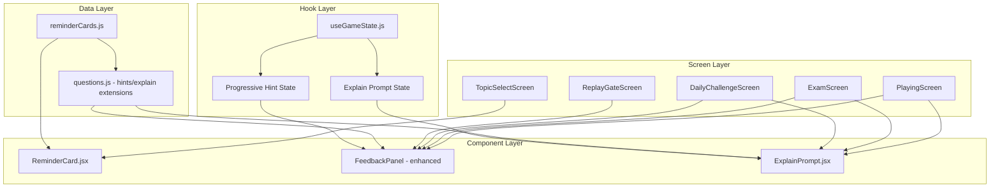

# Design Document: Learning Enhancement

## Overview

This feature adds three learning enhancements to Algebra Assault that reinforce algebraic understanding before, during, and after answering questions:

1. **Micro-lessons (Reminder Cards)** — A brief overlay shown before topic missions displaying the key algebraic rule for the selected topic, with a 15-second auto-dismiss timer and manual "Got it" button.
2. **Progressive Hints** — A staged hint system replacing the current immediate solution reveal on wrong answers, offering conceptual → specific → full solution hints with HP/point costs.
3. **"Explain Your Answer" Mode** — Occasional follow-up multiple-choice questions after correct answers that verify the student understood the method rather than guessing.

These enhancements integrate with the existing game loop, HP system, scoring, and screen routing without requiring new external dependencies.

## Architecture

The feature follows the existing modular architecture with new data modules, UI components, and hook logic:



### Key Design Decisions

1. **Reminder Card as a transitional screen state** — Rather than adding a new top-level screen, the reminder card is an overlay state within the mission-start flow in `useGameState`. After the user selects a topic from `TopicSelectScreen`, the hook sets a `showReminderCard` state that the `PlayingScreen` (or a wrapper) renders as an overlay before the game loop starts. This avoids adding a new screen route.

2. **Progressive hints extend the existing FeedbackPanel** — The current `FeedbackPanel` in `PlayingScreen.jsx` already handles wrong-answer feedback. We extend it with hint-stage state rather than creating a separate component, keeping the UI consistent.

3. **Explain prompt as a standalone component** — The explain-your-answer flow is distinct from the feedback panel (it appears after correct answers), so it gets its own `ExplainPrompt.jsx` component rendered conditionally in each question screen.

4. **Data co-located with questions** — Hint arrays are added directly to the question objects in `questions.js`. Reminder card rules and explain prompts are in separate data files (`reminderCards.js`, and `explain` objects on questions) to keep concerns separated.

5. **No new dependencies** — All features use React state, timers (`setTimeout`/`setInterval`), and `Math.random()` for trigger logic. No external libraries needed.

## Components and Interfaces

### New Data Module: `src/data/reminderCards.js`

```javascript
/**
 * Maps topic identifiers to their key algebraic rule string.
 * Each rule is ≤15 words.
 */
export const REMINDER_CARDS = {
  linear: "Whatever you do to one side, do to the other",
  quadratic: "Standard form → Factor → Zero product",
  expExpr: "Same base: multiply → add exponents, divide → subtract exponents",
  expEqn: "Make bases equal, then set exponents equal",
  inequality: "Multiply or divide by negative → FLIP the sign",
  simultaneous: "Eliminate one variable by adding or subtracting equations",
};
```

### Extended Question Data Structure

Each question object in `questions.js` gains two optional properties:

```javascript
{
  q: '2x + 5 = 13',
  a: 'x = 4',
  wrong: [...],
  hint: 'Subtract 5, then divide by 2',       // existing — becomes hints[1]
  steps: ['Subtract 5 → 2x = 8', 'Divide by 2 → x = 4'],  // existing — becomes hints[2]
  hints: [
    "What operation undoes addition?",          // index 0: conceptual (≤60 chars)
    "Subtract 5, then divide by 2",            // index 1: specific (≤80 chars)
    ["Subtract 5 → 2x = 8", "Divide by 2 → x = 4"]  // index 2: full solution (array)
  ],
  explain: {                                    // optional
    prompt: "Which step did you do first?",
    options: ["Subtracted 5 from both sides", "Divided by 2", "Added 5 to both sides"],
    correctIndex: 0
  }
}
```

### New Component: `src/components/ReminderCard.jsx`

```javascript
/**
 * @param {Object} props
 * @param {string} props.topic - Topic identifier (e.g., 'linear')
 * @param {string} props.topicName - Display name (e.g., 'Linear Equations')
 * @param {string} props.rule - The Topic_Rule text
 * @param {function} props.onDismiss - Called when card is dismissed (timer or button)
 */
export function ReminderCard({ topic, topicName, rule, onDismiss })
```

**Behavior:**
- Renders a full-screen overlay with topic name, rule text, countdown (whole seconds), and "Got it" button
- Auto-dismisses after 15 seconds via `setTimeout`
- Cleans up timer on unmount (back navigation)

### New Component: `src/components/ExplainPrompt.jsx`

```javascript
/**
 * @param {Object} props
 * @param {string} props.prompt - The follow-up question text
 * @param {string[]} props.options - Array of 3 option strings
 * @param {number} props.correctIndex - Index of correct option (0-2)
 * @param {function} props.onComplete - Called with { correct: boolean, bonusPoints: number }
 */
export function ExplainPrompt({ prompt, options, correctIndex, onComplete })
```

**Behavior:**
- Renders prompt text and 3 option buttons
- On selection: highlights correct/wrong, shows feedback, awards 50 bonus points if correct
- Auto-dismisses after 15 seconds of inactivity (no points awarded)
- Disables buttons after selection, dismisses after 2 seconds

### Enhanced FeedbackPanel (in PlayingScreen, ExamScreen, DailyChallengeScreen, ReplayGateScreen)

The existing `FeedbackPanel` component gains progressive hint support:

```javascript
/**
 * Additional props for progressive hints:
 * @param {number} props.hintStage - Current hint stage (0=none, 1=conceptual, 2=specific, 3=full)
 * @param {function} props.onRequestHint - Called when user clicks hint button
 * @param {string} props.hintCostLabel - e.g., "Get Hint (-5 HP)" or "Next Hint (-5 HP)"
 * @param {string} props.gameMode - 'playing' | 'exam' | 'daily' | 'replayGate'
 */
```

### Hook Changes: `src/hooks/useGameState.js`

New state variables:
- `hintStage` (number, 0-3): tracks current hint reveal level per question
- `showReminderCard` (boolean): whether reminder card overlay is active
- `reminderTopic` (string|null): topic for the reminder card
- `explainPromptData` (object|null): current explain prompt to display
- `explainCooldown` (number): count of correct answers since last explain prompt
- `explainPaused` (boolean): whether gameplay is paused for explain prompt

New handler functions:
- `handleRequestHint(gameMode)`: advances hint stage, deducts HP/points
- `handleExplainResponse(correct)`: processes explain prompt answer
- `handleReminderDismiss()`: dismisses reminder card and starts mission
- `shouldTriggerExplain(question)`: checks trigger rate + cooldown

## Data Models

### Reminder Card Data

| Field | Type | Constraints |
|-------|------|-------------|
| topic key | string | One of: `linear`, `quadratic`, `expExpr`, `expEqn`, `inequality`, `simultaneous` |
| rule value | string | ≤15 words, describes single algebraic principle |

### Progressive Hints (per question)

| Field | Type | Constraints |
|-------|------|-------------|
| `hints[0]` | string | Conceptual nudge, ≤60 characters, no specific numbers |
| `hints[1]` | string | Specific operation + values, ≤80 characters |
| `hints[2]` | string[] | Full worked solution steps array |

### Hint Costs

| Game Mode | Conceptual (idx 0) | Specific (idx 1) | Full Solution (idx 2) | Unit |
|-----------|--------------------|--------------------|----------------------|------|
| PlayingScreen | 5 | 5 | 10 | HP |
| DailyChallengeScreen | 5 | 5 | 10 | HP |
| ExamScreen | 25 | 25 | 50 | points |
| ReplayGateScreen | 0 | 0 | 0 | — |

### Explain Prompt Data (per question, optional)

| Field | Type | Constraints |
|-------|------|-------------|
| `prompt` | string | ≤80 characters, asks about first step |
| `options` | string[3] | Each ≤60 characters, plain language |
| `correctIndex` | number | 0, 1, or 2 |

### Explain Trigger Configuration

| Parameter | Value |
|-----------|-------|
| Trigger_Rate | 0.3 (30%) |
| Cooldown | 3 correct answers since last prompt |
| Bonus Points (correct) | 50 |
| Timeout | 15 seconds |
| Dismiss delay after response | 2 seconds |
| Active in ReplayGateScreen | No |

## Correctness Properties

*A property is a characteristic or behavior that should hold true across all valid executions of a system — essentially, a formal statement about what the system should do. Properties serve as the bridge between human-readable specifications and machine-verifiable correctness guarantees.*

### Property 1: Reminder card rules satisfy word count constraint

*For any* entry in the REMINDER_CARDS data object, splitting the rule string by whitespace should yield no more than 15 tokens.

**Validates: Requirements 1.2, 1.4**

### Property 2: Reminder card displays only for playable topic missions

*For any* topic identifier, calling the reminder card display logic should return true if and only if the topic is one of the six playable topics (linear, quadratic, expExpr, expEqn, inequality, simultaneous) and NOT for ultimate, exam, or dailyChallenge modes.

**Validates: Requirements 2.1, 2.5**

### Property 3: Hints array entries satisfy type and length constraints

*For any* question object that has a `hints` array, the array should have exactly 3 entries where: index 0 is a string of ≤60 characters, index 1 is a string of ≤80 characters, and index 2 is a non-empty array of strings.

**Validates: Requirements 3.1, 3.3, 3.4, 3.5**

### Property 4: Hints fallback resolution produces valid 3-level structure

*For any* question object that has a `hint` string and `steps` array but no `hints` array, the resolved hints structure should have: index 1 equal to the original `hint` value, index 2 equal to the original `steps` array, and index 0 as a string of ≤60 characters.

**Validates: Requirements 3.2, 3.6**

### Property 5: Hint stage progression is accumulative and ordered

*For any* question with valid hints and any hint stage transition (0→1, 1→2, 2→3), advancing to the next stage should reveal the corresponding hints array entry while all previously revealed hints remain visible in the output state.

**Validates: Requirements 4.2, 4.3, 4.4, 4.5**

### Property 6: Hint cost deduction matches mode-specific cost table

*For any* combination of game mode (playing, exam, daily, replayGate) and hint stage (0, 1, 2), the resource deducted should match the specification: PlayingScreen/DailyChallengeScreen deducts HP (5, 5, 10), ExamScreen deducts points (25, 25, 50), ReplayGateScreen deducts nothing. The resource value should floor at 0 for HP and have no floor for exam points.

**Validates: Requirements 5.1, 5.2, 5.3, 5.5, 6.1, 6.2, 6.3, 6.4**

### Property 7: Malformed hints gracefully degrade to full solution only

*For any* question whose hints array has fewer than 3 entries or contains null/empty entries at indices 0 or 1, the hint system should skip intermediate stages and present only the full worked solution directly.

**Validates: Requirements 6.5**

### Property 8: Explain prompt data satisfies structural constraints

*For any* question object that has an `explain` property, the explain object should have: a `prompt` string of ≤80 characters, an `options` array of exactly 3 strings each ≤60 characters, and a `correctIndex` that is 0, 1, or 2.

**Validates: Requirements 7.1**

### Property 9: Explain trigger logic respects mode, cooldown, and probability

*For any* tuple of (gameMode, cooldownCount, randomValue, hasExplainData), the explain trigger function should return true if and only if: gameMode is not 'replayGate' AND hasExplainData is true AND cooldownCount ≥ 3 AND randomValue < 0.3.

**Validates: Requirements 8.1, 8.2, 8.4, 10.1, 10.2, 10.3, 10.4**

### Property 10: Explain response scoring awards exactly +50 or +0 with no penalties

*For any* current score and HP value, responding to an explain prompt should: add exactly 50 points if the selected option matches correctIndex, add 0 points if it does not match, and never modify HP regardless of correctness.

**Validates: Requirements 9.2, 9.4**

## Error Handling

### Reminder Card Errors

| Scenario | Handling |
|----------|----------|
| Topic identifier not found in REMINDER_CARDS | Skip reminder card display, proceed directly to mission start |
| Timer cleanup on unmount (back navigation) | `clearTimeout` in useEffect cleanup; card dismissed, no mission started |
| Component unmounts during countdown | Timer cleared, no state updates on unmounted component |

### Progressive Hint Errors

| Scenario | Handling |
|----------|----------|
| Question has no hints array and no hint/steps | Show "Continue" button only (no hint buttons), display correct answer |
| hints array has null/undefined entries | Skip that stage, advance to next available stage or full solution |
| HP drops to 0 during hint request | Set HP to 0, display the requested hint fully, schedule game-over after 2s |
| Score goes negative in ExamScreen | Allow negative score (no floor enforcement per Req 6.7) |
| Question index out of bounds | Use modulo wrapping (existing pattern: `qIdx % questions.length`) |

### Explain Prompt Errors

| Scenario | Handling |
|----------|----------|
| Question has no explain object | Never trigger explain prompt for that question |
| explain.correctIndex out of range | Treat as no explain data (skip prompt) |
| explain.options has fewer than 3 entries | Treat as no explain data (skip prompt) |
| Component unmounts during 15s timeout | Clear timeout, no state updates |
| Component unmounts during 2s dismiss delay | Clear timeout, no state updates |
| Random number generation failure | Default to not triggering (fail closed) |

## Testing Strategy

### Property-Based Tests (using fast-check)

The project already has `fast-check` installed. Each correctness property will be implemented as a property-based test with a minimum of 100 iterations.

**Test file:** `src/data/learningEnhancement.test.js`

Tests will cover:
- **Property 1**: Generate random reminder card data, verify word count ≤15
- **Property 2**: Generate random topic identifiers, verify display condition
- **Property 3**: Generate question objects with hints arrays, verify structural constraints
- **Property 4**: Generate questions with hint+steps but no hints array, verify fallback resolution
- **Property 5**: Generate hint stage sequences, verify accumulative visibility
- **Property 6**: Generate (mode, stage, currentResource) tuples, verify cost deduction
- **Property 7**: Generate malformed hints arrays, verify graceful degradation
- **Property 8**: Generate explain objects, verify structural constraints
- **Property 9**: Generate trigger condition tuples, verify boolean logic
- **Property 10**: Generate (score, hp, isCorrect) tuples, verify scoring

**Configuration:**
- Minimum 100 iterations per property test
- Each test tagged with: `Feature: learning-enhancement, Property {N}: {description}`

### Unit Tests (example-based)

**Test file:** `src/components/ReminderCard.test.jsx`, `src/components/ExplainPrompt.test.jsx`

- Reminder card renders topic name, rule, and countdown
- Reminder card "Got it" button calls onDismiss
- Reminder card auto-dismisses after 15 seconds (fake timers)
- FeedbackPanel shows "Get Hint" and "Continue" on wrong answer
- FeedbackPanel hides "Teach Me" when hint flow is active
- ExplainPrompt renders 3 option buttons
- ExplainPrompt highlights correct option on wrong selection
- ExplainPrompt auto-dismisses after 15s timeout
- ExplainPrompt disables buttons after selection
- Specific reminder card text values match requirements (Req 1.3)
- Exam timer pauses during explain prompt
- Game loop pauses during explain prompt

### Integration Tests

- Full flow: select topic → reminder card → dismiss → game starts
- Full flow: wrong answer → Get Hint → Next Hint → Show Solution → Continue
- Full flow: correct answer → explain prompt triggers → respond → resume
- HP reaches 0 via hint cost → game over sequence
- Explain cooldown resets on new mission start

