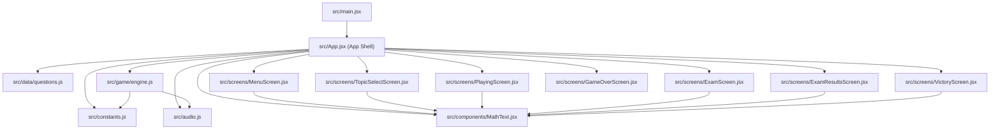

# Design Document: Modular File Split

## Overview

This design describes the structural decomposition of the monolithic `src/App.jsx` (~2300 lines) into a set of focused ES modules. The refactor is purely mechanical — no behavior changes, no new features, no API modifications. The goal is improved maintainability through logical separation of concerns while preserving byte-for-byte functional equivalence.

The split follows natural seams already visible in the existing code (marked by comment headers like `// ========== MENU ==========`). Each extracted module maps to a single responsibility: data, configuration, audio, game logic, or UI screen.

## Architecture

### Module Dependency Graph



### Design Principles

1. **No circular dependencies** — The module graph is a DAG. Leaf modules (constants, questions, audio) depend on nothing. The engine depends on constants and audio. Screen components depend on shared components. The App Shell imports everything.
2. **Props-down communication** — Screen components receive all state and callbacks as props from the App Shell. They never import the App Shell or reach into sibling modules.
3. **Mutable state object pattern preserved** — The game engine continues to operate on `gameRef.current` passed by reference. No new state management patterns are introduced.
4. **ES named exports everywhere** — All modules use named exports (except the App Shell which keeps its default export for Vite's entry point convention).

### File Tree After Refactor

```
src/
├── main.jsx                          # Unchanged (React root mount + storage polyfill)
├── App.jsx                           # App Shell — state, effects, orchestration (~400 lines)
├── index.css                         # Unchanged
├── constants.js                      # Game configuration values
├── audio.js                          # Web Audio API sound system
├── data/
│   └── questions.js                  # Question bank + topic metadata
├── game/
│   └── engine.js                     # Canvas game loop (updateGame, drawGame, helpers)
├── components/
│   └── MathText.jsx                  # Shared MathText component
└── screens/
    ├── MenuScreen.jsx                # Menu screen
    ├── TopicSelectScreen.jsx         # Topic selection screen
    ├── PlayingScreen.jsx             # Active gameplay screen (canvas + HUD + question modal)
    ├── ExamScreen.jsx                # Exam simulator screen
    ├── ExamResultsScreen.jsx         # Exam results screen
    ├── VictoryScreen.jsx             # Victory screen
    └── GameOverScreen.jsx            # Game over screen
```

## Components and Interfaces

### 1. Question Data Module (`src/data/questions.js`)

**Exports:**
```js
export const QUESTIONS = { /* ... */ };
export const TOPICS_ORDER = ['linear', 'quadratic', 'expExpr', 'expEqn', 'inequality', 'simultaneous', 'ultimate', 'exam'];
export const PLAYABLE_TOPICS = ['linear', 'quadratic', 'expExpr', 'expEqn', 'inequality', 'simultaneous', 'ultimate'];
```

**Rationale:** This is the largest single block in App.jsx (~350 lines of static data). Extracting it removes visual noise from the logic file and makes question editing trivial.

**Extraction approach:** Direct cut-and-paste. No transformation needed — the data is already a standalone constant with no dependencies.

---

### 2. Constants Module (`src/constants.js`)

**Exports:**
```js
// Canvas dimensions
export const W = 400;
export const H = 600;

// HP system
export const MAX_HP = 100;
export const DMG_BULLET = 12;
export const DMG_ALIEN = 22;
export const DMG_BOSS_BULLET = 18;
export const DMG_WRONG = 25;
export const HEALTH_RESTORE = 30;
export const HP_CORRECT_BONUS = 18;

// Wave settings
export const WAVES_BEFORE_BOSS = 4;
export const ALIENS_PER_WAVE = 10;

// Boss settings
export const BOSS_HP = 3;
export const ULTIMATE_BOSS_HP = 3;
export const BOSS_PHASE_HP = 20;
export const ULTIMATE_BOSS_PHASE_HP = 30;

// Power-up configuration
export const POWERUP_DROP_CHANCE = 0.18;
export const POWERUP_DURATIONS = { shield: 6000, rapid: 8000, triple: 8000 };
export const BOSS_SHIELD_DURATION = 5000;
export const POWERUP_INFO = { /* shield, rapid, triple, health, nuke */ };
export const POWERUP_TYPES = Object.keys(POWERUP_INFO);

// Exam settings
export const EXAM_TIMER_SECONDS = 25;
export const EXAM_QUESTION_COUNT = 10;
export const EXAM_LIVES = 3;
export const EXAM_LOW_TIMER = 10;
export const EXAM_CRITICAL_TIMER = 5;

// Derived helpers
export const getMaxBossHp = (t) => t === 'ultimate' ? ULTIMATE_BOSS_HP : BOSS_HP;
export const getBossPhaseHp = (t) => t === 'ultimate' ? ULTIMATE_BOSS_PHASE_HP : BOSS_PHASE_HP;
```

**Rationale:** Centralizes all tuning knobs. A game designer can adjust balance without touching logic.

---

### 3. Audio Module (`src/audio.js`)

**Exports:**
```js
export const playSound = (type, enabled) => { /* ... */ };
```

**Interface contract:**
- `type`: one of `"shoot"`, `"kill"`, `"correct"`, `"wrong"`, `"hit"`, `"levelUp"`, `"boss"`, `"powerup"`, `"nuke"`, `"heal"`, `"tick"`, `"tickHigh"`
- `enabled`: boolean — if false, returns immediately without creating an AudioContext
- Returns: `undefined` (fire-and-forget)
- Error handling: wraps all Web Audio API calls in try/catch, silently swallows errors
- Unsupported type: no-op (no error thrown)

**Extraction approach:** Direct cut-and-paste of the `playSound` function. No dependencies on other app modules.

---

### 4. Game Engine (`src/game/engine.js`)

**Exports:**
```js
export function updateGame(game) { /* ... */ }
export function drawGame(ctx, game) { /* ... */ }
export function spawnParticles(game, x, y, color, count) { /* ... */ }
export function damagePlayer(game, dmg) { /* ... */ }
export function applyPowerup(game, type) { /* ... */ }
```

**Imports:**
```js
import { W, H, DMG_BULLET, DMG_ALIEN, DMG_BOSS_BULLET, ALIENS_PER_WAVE, POWERUP_DROP_CHANCE, POWERUP_TYPES, POWERUP_INFO, POWERUP_DURATIONS, HEALTH_RESTORE } from '../constants.js';
import { playSound } from '../audio.js';
```

**Interface contract:**
- `updateGame(game)` — mutates the `game` state object in place. Sets `game.triggerQuestion = true` when a wave is complete. Accumulates damage in `game.pendingHpChange`. Increments `game.killCount`.
- `drawGame(ctx, game)` — reads game state, draws to the provided 2D canvas context. Pure rendering, no mutations except resetting `ctx` state.
- `spawnParticles`, `damagePlayer`, `applyPowerup` — helper functions also needed by the App Shell for question-answer handling and boss transitions.

**Design decision:** The engine does NOT call `setScore` or any React state setter directly. Instead it communicates via the Event_Dispatcher — a synchronous callback system passed as a parameter to `updateGame`. When damage occurs or a wave completes, the engine calls `dispatcher.emit(event)` inline, and the App Shell's registered callbacks update React state immediately. This replaces the previous 80ms `setInterval` polling bridge, eliminating timing-dependent bugs where multiple damage events could accumulate between poll intervals.

**Note on `drawPowerup`:** This is a private helper used only within `drawGame` and does not need to be exported.

---

### 5. MathText Component (`src/components/MathText.jsx`)

**Exports:**
```js
export function MathText({ children, className = '' }) { /* ... */ }
```

**Imports:** React only.

**Extraction approach:** Direct cut-and-paste of the `MathText` function plus its supporting constants (`SUPERSCRIPT_MAP`, `SUBSCRIPT_MAP`, `RUN_CONTINUE`). These maps are module-private.

---

### 6. Screen Components (`src/screens/*.jsx`)

Each screen component is a pure presentational component that receives props from the App Shell.

**Common pattern:**
```js
import { MathText } from '../components/MathText.jsx';
// lucide-react icons as needed

export function MenuScreen({ soundOn, setSoundOn, setScreen, setShowDisclaimer, showDisclaimer }) {
  return ( /* JSX */ );
}
```

**Props strategy:** Each screen receives only the state and callbacks it needs. The App Shell destructures its state and passes relevant slices. This keeps screen components focused and testable in isolation.

| Screen | Key Props |
|--------|-----------|
| MenuScreen | `soundOn`, `setSoundOn`, `setScreen`, `showDisclaimer`, `setShowDisclaimer` |
| TopicSelectScreen | `completed`, `startMission`, `setScreen`, `soundOn`, `setSoundOn` |
| PlayingScreen | `canvasRef`, `hp`, `score`, `bossActive`, `bossHp`, `waveNumber`, `aliensKilled`, `topic`, `showQuestion`, `feedback`, `paused`, `activePowerups`, `soundOn`, handlers... |
| ExamScreen | `questions`, `qIdx`, `score`, `examTimer`, `examLives`, `examFeedback`, `soundOn`, `handleExamAnswer`, `setScreen` |
| ExamResultsScreen | `examCorrect`, `score`, `examLives`, `examDuration`, `startExam`, `setScreen` |
| VictoryScreen | `topic`, `score`, `hp`, `bestStreak`, `completed`, `startMission`, `setScreen`, `soundOn` |
| GameOverScreen | `topic`, `score`, `waveNumber`, `bossActive`, `startMission`, `setScreen` |

**Design decision:** The `<style>` blocks containing CSS animations (twinkle, confetti, pulse-slow, etc.) move with their respective screen components. Each screen is self-contained.

---

### 7. App Shell (`src/App.jsx`)

After extraction, the App Shell retains:
- All `useState` and `useRef` declarations
- All `useEffect` hooks (keyboard, pointer, game loop, bridge interval, exam timer)
- The `startMission`, `startBoss`, `startExam`, `handleAnswer`, `handleExamAnswer`, `advanceExam`, `pickRandom`, `saveProgress` functions
- Screen routing logic (conditional rendering based on `screen` state)
- Import statements for all extracted modules

**Estimated size:** ~400–450 lines (down from ~2300).

## Data Models

### Game State Object (`gameRef.current`)

This mutable object is the central data structure shared between the App Shell and the Game Engine. Its shape is unchanged by the refactor:

```js
{
  player: { x, y, vx, vy, radius, invuln, lastShot },
  aliens: [{ x, y, vx, vy, radius, lastShot, shotInterval, type, wobble }],
  bullets: [{ x, y, vx, vy, radius }],
  enemyBullets: [{ x, y, vx, vy, radius, isBoss? }],
  particles: [{ x, y, vx, vy, color, life, maxLife, radius }],
  stars: [{ x, y, size, speed, opacity }],
  powerups: [{ x, y, vx, vy, radius, type, bob, life }],
  damageNumbers: [{ x, y, vy, life, text, color }],
  boss: null | { x, y, vx, vy, radius, lastShot, attackPhase, wobble, phaseHp, maxPhaseHp },
  keys: { [key: string]: boolean },
  pointer: { x, y, active },
  spawnTimers: { alien },
  flash, flashColor, shake,
  bossActive, paused, waveNumber, soundOn,
  killCount, killPulse,
  activePowerups: { shield, rapid, triple },  // timestamps (Date.now() + duration)
  pendingNuke
}
```

### Question Object Shape

```js
{
  q: string,       // Question text (may contain Unicode superscripts/subscripts)
  a: string,       // Correct answer
  wrong: [string, string, string],  // Three distractor answers
  hint: string     // Hint shown on wrong answer
}
```

### Topic Metadata Shape

```js
{
  name: string,      // Full display name
  short: string,     // Abbreviated name for HUD
  color: string,     // Hex color
  bgColor: string,   // Tailwind gradient classes
  icon: string,      // Emoji or text icon
  isUltimate?: boolean,
  isExam?: boolean
}
```

### Storage Format

Key: `"matteo-progress"`
Value: JSON string of `{ [topicKey: string]: true }`

Example: `{"linear":true,"quadratic":true}`

Key: `"disclaimer-dismissed"`
Value: Truthy string (e.g., `"true"`)

Example: `"true"`

Key: `"matteo-highscores"`
Value: JSON string of `{ [topicKey: string]: number }`

Example: `{"linear":4500,"quadratic":3200,"exam":8700}`

Key: `"matteo-progress-history"`
Value: JSON string of `SessionRecord[]` (max 50 entries)

Example: `[{"topic":"linear","questionsAttempted":10,"questionsCorrect":7,"questionsWrong":3,"timeSpent":145,"difficultyBreakdown":{"easy":{"attempted":3,"correct":3},"medium":{"attempted":4,"correct":3},"hard":{"attempted":3,"correct":1}},"timestamp":1700000000000}]`


## Correctness Properties

*A property is a characteristic or behavior that should hold true across all valid executions of a system — essentially, a formal statement about what the system should do. Properties serve as the bridge between human-readable specifications and machine-verifiable correctness guarantees.*

### Property 1: Question data structure invariant

*For any* topic key in the QUESTIONS export (excluding those with `isUltimate` or `isExam` set to true), the topic object SHALL contain `name` (string), `short` (string), `color` (string), `bgColor` (string), `icon` (string), and three arrays `easy`, `medium`, `hard` where every element has fields `q` (string), `a` (string), `wrong` (array of exactly 3 strings), and `hint` (string).

**Validates: Requirements 1.1**

### Property 2: getMaxBossHp and getBossPhaseHp correctness

*For any* string input `t`, `getMaxBossHp(t)` SHALL return `ULTIMATE_BOSS_HP` if `t === "ultimate"` and `BOSS_HP` for all other strings; similarly `getBossPhaseHp(t)` SHALL return `ULTIMATE_BOSS_PHASE_HP` if `t === "ultimate"` and `BOSS_PHASE_HP` otherwise.

**Validates: Requirements 2.5**

### Property 3: playSound never throws

*For any* string `type` (including unsupported types, empty string, and random Unicode) and *for any* boolean `enabled` value, calling `playSound(type, enabled)` SHALL never throw an exception, regardless of whether the Web Audio API is available or throws internally.

**Validates: Requirements 3.5, 3.6, 3.7**

### Property 4: updateGame preserves player bounds

*For any* valid game state object where the player position starts within canvas bounds, after calling `updateGame(game)`, the player position SHALL remain within `[player.radius, W - player.radius]` for x and `[player.radius, H - player.radius]` for y.

**Validates: Requirements 4.4**

### Property 5: MathText superscript/subscript character mapping

*For any* input string containing Unicode superscript characters (U+2070–U+207F, U+00B9, U+00B2, U+00B3, U+02E3) or subscript characters (U+2080–U+208E), the MathText component SHALL render `<sup>` or `<sub>` elements respectively, where the text content of each element contains only the base-character equivalents from the mapping (digits 0-9, operators, letters).

**Validates: Requirements 6.4**

### Property 6: MathText consecutive character grouping

*For any* string containing N consecutive Unicode superscript characters (N ≥ 2), the MathText component SHALL produce exactly one `<sup>` element containing all N mapped characters concatenated, rather than N separate `<sup>` elements. The same grouping rule applies to consecutive subscript characters and `<sub>` elements.

**Validates: Requirements 6.5**

### Property 7: Wave completion triggers question

*For any* game state where `bossActive` is false and an alien is killed such that `killCount` reaches `ALIENS_PER_WAVE`, the `updateGame` function SHALL dispatch a `"waveComplete"` event via the Event_Dispatcher and reset `killCount` to `0`.

**Validates: Requirements 4.5, 7.7, 9.3**

### Property 8: Progress serialization round-trip

*For any* object mapping a subset of valid topic keys to `true`, serializing with `JSON.stringify` and deserializing with `JSON.parse` SHALL produce an object deeply equal to the original, ensuring the Storage_API persistence format is lossless.

**Validates: Requirements 7.6**

### Property 9: Event dispatch delivers collision events individually with correct shape

*For any* game state containing one or more pending collisions (alien collision, enemy bullet hit, or boss bullet hit) within a single frame, calling `updateGame(game, dispatcher)` SHALL invoke the dispatcher once per collision event, in the order the collisions are detected, where each event object contains a `type` field of `"damage"` and an `amount` field equal to the appropriate damage constant (DMG_ALIEN, DMG_BULLET, or DMG_BOSS_BULLET).

**Validates: Requirements 9.2, 9.5**

### Property 10: Wave completion dispatches event

*For any* game state where `bossActive` is false and a kill occurs such that `killCount` reaches `ALIENS_PER_WAVE`, calling `updateGame(game, dispatcher)` SHALL invoke the dispatcher with an event of type `"waveComplete"` containing the current `waveNumber`.

**Validates: Requirements 9.3**

### Property 11: Immediate game-over on lethal damage

*For any* HP value and damage event where `HP - damage.amount <= 0`, the App Shell's damage handler SHALL trigger the game-over transition synchronously within the same callback invocation, without deferring to a future frame or poll cycle.

**Validates: Requirements 9.6**

### Property 12: Shuffler output is a permutation of input

*For any* array of 4 distinct answer strings and *for any* integer seed, `shuffleAnswers(answers, seed)` SHALL return an array containing exactly the same 4 elements as the input (same multiset), with length 4.

**Validates: Requirements 10.1**

### Property 13: Shuffler determinism

*For any* array of 4 answer strings and *for any* integer seed, calling `shuffleAnswers(answers, seed)` multiple times with the same arguments SHALL always produce the same output array (element-wise equality).

**Validates: Requirements 10.2**

### Property 14: Shuffler uniform distribution

*For any* fixed array of 4 distinct answer strings, running `shuffleAnswers` across a range of consecutive seed values (0 to N, where N ≥ 2400) SHALL produce a distribution where each of the 24 possible permutations appears with frequency within acceptable bounds of 1/24 (chi-squared test with p > 0.01), demonstrating independence from answer content and character code sums.

**Validates: Requirements 10.3, 10.4**

### Property 15: Disclaimer visibility determined by storage value

*For any* value retrieved from Storage_API under key `"disclaimer-dismissed"`, the App Shell SHALL show the Disclaimer_Screen if and only if the value is falsy (null, undefined, false, 0, empty string, or key missing). For any truthy value, the disclaimer SHALL be skipped.

**Validates: Requirements 11.3, 11.4**

### Property 16: Canvas DPI scaling dimensions

*For any* `devicePixelRatio` value ≥ 1, after calling `setupCanvas(canvas, W, H)`, the canvas element SHALL have `width` attribute equal to `W × devicePixelRatio`, `height` attribute equal to `H × devicePixelRatio`, CSS width equal to `W` pixels, and CSS height equal to `H` pixels.

**Validates: Requirements 12.1, 12.2**

### Property 17: Canvas context scale matches DPR

*For any* `devicePixelRatio` value ≥ 1, after calling `setupCanvas(canvas, W, H)`, the 2D rendering context SHALL have `ctx.scale(devicePixelRatio, devicePixelRatio)` applied, ensuring all drawing operations use logical coordinates (0–W for x, 0–H for y) regardless of physical pixel density.

**Validates: Requirements 12.3**

### Property 18: Dynamic DPR re-application

*For any* change in `devicePixelRatio` during a session, calling `updateCanvasScale(canvas, ctx, W, H)` on the next animation frame SHALL re-apply the scaling: updating canvas attributes to `W × newDPR` and `H × newDPR`, resetting the context transform, and applying `ctx.scale(newDPR, newDPR)`.

**Validates: Requirements 12.6**

### Property 19: Wave difficulty parameters within bounds

*For any* wave number in {1, 2, 3, 4}, calling `getWaveDifficulty(waveNumber)` SHALL return a `spawnInterval`, `alienSpeed`, and `shootingInterval` that fall within the specified bounds for that wave: wave 1 (spawn ≥ 90, speed ≤ 1.2, shooting ≥ 180), wave 2 (spawn ∈ [60, 80], speed ∈ [1.3, 1.8], shooting ∈ [140, 170]), wave 3 (spawn ∈ [40, 60], speed ∈ [1.9, 2.4], shooting ∈ [100, 130]), wave 4 (spawn ≤ 40, speed ≥ 2.5, shooting ≤ 90).

**Validates: Requirements 13.1, 13.2, 13.3, 13.4**

### Property 20: Wave difficulty monotonic progression

*For any* consecutive wave pair (n, n+1) where n ∈ {1, 2, 3}, the difficulty parameters SHALL satisfy: `getWaveDifficulty(n+1).spawnInterval ≤ getWaveDifficulty(n).spawnInterval` (aliens spawn faster), `getWaveDifficulty(n+1).alienSpeed ≥ getWaveDifficulty(n).alienSpeed` (aliens move faster), and `getWaveDifficulty(n+1).shootingInterval ≤ getWaveDifficulty(n).shootingInterval` (aliens shoot more often).

**Validates: Requirements 13.5**

### Property 21: Boss label correctness during active shield

*For any* game state where the boss is active and the player has an active Shield power-up, the boss phase HP bar label SHALL be the string "ARMOR" and the player's power-up indicator SHALL use the string "SHIELD", with no naming collision between the two elements.

**Validates: Requirements 14.1, 14.2, 14.3**

### Property 22: Exam wrong-answer feedback matches shooter mode

*For any* exam question answered incorrectly (or timed out), calling `triggerWrongAnswerFeedback(game)` SHALL set `game.shake` and `game.flash` to the same values used by the shooter mode's wrong-answer handler, and `game.flashColor` SHALL equal `'#ef4444'`.

**Validates: Requirements 15.1, 15.2, 15.3**

### Property 23: AudioContext singleton guarantee

*For any* sequence of `playSound` calls (with varying type strings and enabled values), the Audio_Module SHALL create at most one AudioContext instance across all calls. After the first successful creation, no subsequent call SHALL invoke the AudioContext constructor again.

**Validates: Requirements 17.1, 17.4**

### Property 24: AudioContext retry after creation failure

*For any* sequence of `playSound` calls where the first N calls fail due to AudioContext constructor throwing (N ≥ 1), the Audio_Module SHALL attempt AudioContext creation again on call N+1. Once creation succeeds, the successfully created context SHALL be reused for all subsequent calls without further constructor invocations.

**Validates: Requirements 17.5**

### Property 25: Reduced motion suppresses visual effects

*For any* game state with non-zero `shake`, non-zero `flash`, or pending particle spawns, when `reducedMotion` is `true`, the engine SHALL: treat shake as zero (no screen displacement), skip flash overlay rendering, and not add new particles to the particles array. The resulting game state after `updateGame` SHALL have `shake === 0` and no newly spawned particles.

**Validates: Requirements 18.2, 18.3, 18.4**

### Property 26: Reduced motion preserves gameplay logic

*For any* valid game state, running `updateGame(game, dispatcher, { reducedMotion: true })` SHALL produce identical gameplay outcomes (player position, alien positions, bullet positions, collision results, kill count, wave progression, damage events dispatched) as running `updateGame(game, dispatcher, { reducedMotion: false })` on the same initial state. Only visual state (particles array length, shake value, flash value) may differ.

**Validates: Requirements 18.5**

### Property 27: High score persistence preserves maximum

*For any* topic key and *for any* sequence of scores `[s1, s2, ..., sN]` applied via `saveHighScore(topic, score)`, the stored high score for that topic SHALL equal `max(s1, s2, ..., sN)`. Specifically, `shouldUpdateHighScore(current, stored)` returns `true` if and only if `stored` is null/undefined or `current > stored`.

**Validates: Requirements 19.1, 19.2, 19.3, 19.4**

### Property 28: Visibility pause only during active gameplay

*For any* screen state value and *for any* current pause state, when `document.visibilityState` changes to `"hidden"`: if `screen === "playing"` and `paused === false`, the game SHALL transition to paused; for all other screen values or if already paused, the pause state SHALL remain unchanged. When visibility returns to `"visible"`, the pause state SHALL not be altered (game stays paused until manual resume).

**Validates: Requirements 20.1, 20.2, 20.4, 20.5**

### Property 29: Keyboard shortcuts select correct answer option

*For any* question modal state (mission or exam) with 4 shuffled answer options and no active feedback, pressing key `K` (where K ∈ {1, 2, 3, 4}) SHALL trigger the answer-handling function with `shuffledOptions[K-1]` as the selected answer, producing the same outcome as clicking the button at grid position K (1=top-left, 2=top-right, 3=bottom-left, 4=bottom-right).

**Validates: Requirements 21.1, 21.2, 21.3**

### Property 30: Keyboard shortcuts inactive without question modal

*For any* game state where no question modal is displayed (`showQuestion === false` and `screen !== 'exam'`), pressing keys 1–4 SHALL not invoke any answer-handling function, and the game state SHALL remain unchanged with respect to score, HP, and question progression.

**Validates: Requirements 21.5**

### Property 31: Progress session history capped at 50

*For any* sequence of N session recordings (N > 50) via `recordSession()`, the persisted history SHALL contain exactly the last 50 sessions in chronological order. For N ≤ 50, all N sessions SHALL be preserved. The stored sessions SHALL be identical in content to the original session data passed to `recordSession()`.

**Validates: Requirements 23.1, 23.2**

### Property 32: Progress metrics computation correctness

*For any* non-empty array of valid SessionRecord objects, `computeMetrics(sessions)` SHALL return: `overallAccuracy` equal to `(sum of questionsCorrect / sum of questionsAttempted) × 100`, `perTopicAccuracy[t]` equal to `(correct for topic t / attempted for topic t) × 100` for each topic present, `totalQuestions` equal to the sum of all `questionsAttempted`, `strongestTopic` equal to the topic key with the highest per-topic accuracy, and `weakestTopic` equal to the topic key with the lowest per-topic accuracy.

**Validates: Requirements 23.3, 23.4**

---

## Components and Interfaces — Structural Improvements (Requirements 9–12)

### 8. Event Dispatcher (`src/game/eventDispatcher.js`)

**Exports:**
```js
export function createEventDispatcher() { /* ... */ }
```

**Interface contract:**

```js
// Factory function returns a dispatcher object
const dispatcher = createEventDispatcher();

// Register a listener
dispatcher.on(eventType, callback);
// or register a catch-all listener
dispatcher.onAny(callback);

// Dispatch an event (called by the engine)
dispatcher.emit(event);
// event shape: { type: string, ...payload }
```

**Event types:**
| Event Type | Payload | Trigger |
|------------|---------|---------|
| `"damage"` | `{ type: "damage", source: "alien"|"bullet"|"bossBullet", amount: number }` | Collision detected in updateGame |
| `"waveComplete"` | `{ type: "waveComplete", waveNumber: number }` | killCount reaches ALIENS_PER_WAVE |
| `"kill"` | `{ type: "kill", killCount: number }` | Alien destroyed |
| `"nuke"` | `{ type: "nuke" }` | Nuke power-up collected |

**Design decisions:**
- The dispatcher is a simple synchronous pub/sub — no async, no batching, no event queue. Events are delivered inline during `updateGame` execution.
- The App Shell creates the dispatcher, registers its callbacks (which call React state setters), and passes it to `updateGame` as a parameter.
- This replaces the 80ms `setInterval` polling loop that previously read `pendingHpChange`, `triggerQuestion`, and `pendingNuke` flags from `gameRef.current`.
- The `pendingHpChange` and `triggerQuestion` fields on the game state object are removed. `killCount` remains for internal engine bookkeeping but is no longer polled externally.

**Integration with Game Engine:**
```js
// Updated engine signature
export function updateGame(game, dispatcher) { /* ... */ }
```

The engine calls `dispatcher.emit(...)` at the exact point where it previously set flags. This ensures damage is processed in the same frame it occurs, eliminating the timing window where multiple damage events could accumulate between poll intervals.

**App Shell integration:**
```js
// In App.jsx — replaces the setInterval bridge
const dispatcher = useMemo(() => createEventDispatcher(), []);

useEffect(() => {
  dispatcher.on('damage', (event) => {
    setHp(prev => {
      const next = Math.max(0, prev - event.amount);
      if (next <= 0) triggerGameOver();
      return next;
    });
  });
  dispatcher.on('waveComplete', () => {
    setShowQuestion(true);
    // pause game, show question UI
  });
  // ... other event handlers
}, []);
```

---

### 9. Answer Shuffler (`src/utils/shuffleAnswers.js`)

**Exports:**
```js
export function shuffleAnswers(answers, seed) { /* ... */ }
```

**Interface contract:**
- `answers`: array of exactly 4 strings (1 correct + 3 distractors)
- `seed`: integer (the current `qIdx` value)
- Returns: a new array of 4 strings in shuffled order (does not mutate input)

**Algorithm — Seeded Fisher-Yates shuffle:**
```js
function mulberry32(seed) {
  return function() {
    seed |= 0; seed = seed + 0x6D2B79F5 | 0;
    let t = Math.imul(seed ^ seed >>> 15, 1 | seed);
    t = t + Math.imul(t ^ t >>> 7, 61 | t) ^ t;
    return ((t ^ t >>> 14) >>> 0) / 4294967296;
  };
}

export function shuffleAnswers(answers, seed) {
  const rng = mulberry32(seed);
  const result = [...answers];
  for (let i = result.length - 1; i > 0; i--) {
    const j = Math.floor(rng() * (i + 1));
    [result[i], result[j]] = [result[j], result[i]];
  }
  return result;
}
```

**Design decisions:**
- **Mulberry32** is chosen as the PRNG because it's fast, has good statistical properties for small state, and produces uniform output from a 32-bit seed. It passes BigCrush and is widely used in game development.
- The seed is `qIdx` (0-indexed question position), which guarantees deterministic shuffling per question while varying across questions.
- Fisher-Yates ensures all 24 permutations are reachable with equal probability (given a uniform RNG).
- This replaces the existing character-code-sum sorting: `[q.a, ...q.wrong].sort((a, b) => charSum(a) - charSum(b))` which produced predictable orderings based on answer content.

**Usage in App Shell:**
```js
import { shuffleAnswers } from './utils/shuffleAnswers.js';

// When presenting a question (both mission and exam):
const options = shuffleAnswers([question.a, ...question.wrong], qIdx);
```

---

### 10. Disclaimer Persistence Logic

**Location:** Integrated into `src/App.jsx` (App Shell)

**Storage key:** `"disclaimer-dismissed"`

**Initialization logic:**
```js
const [showDisclaimer, setShowDisclaimer] = useState(true); // safe default

useEffect(() => {
  (async () => {
    try {
      const result = await window.storage.get('disclaimer-dismissed');
      if (result?.value) {
        setShowDisclaimer(false); // skip disclaimer
      }
    } catch (e) {
      // Storage read failed — show disclaimer as safe default
    }
  })();
}, []);
```

**Dismissal handler:**
```js
const dismissDisclaimer = async () => {
  setShowDisclaimer(false);
  try {
    await window.storage.set('disclaimer-dismissed', 'true');
  } catch (e) {
    // Persist failure is non-critical — disclaimer will show again next time
  }
};
```

**Design decisions:**
- The value stored is the string `"true"` (truthy when read back). Any truthy value from storage skips the disclaimer.
- On storage read failure, the disclaimer shows (safe default) — this matches the existing behavior where `showDisclaimer` starts as `true`.
- The dismissal write is fire-and-forget. If it fails, the user simply sees the disclaimer again next session.
- This is a minimal change to the existing App Shell — the `useState(true)` initial value is preserved, and an additional `useEffect` checks storage on mount.

---

### 11. Canvas DPI Scaling (`src/game/canvasSetup.js`)

**Exports:**
```js
export function setupCanvas(canvas, logicalWidth, logicalHeight) { /* ... */ }
export function updateCanvasScale(canvas, ctx, logicalWidth, logicalHeight) { /* ... */ }
```

**Interface contract:**

```js
// Called once during canvas initialization
const ctx = setupCanvas(canvasRef.current, W, H);
// Returns the 2D context with DPI scaling applied

// Called on each animation frame (handles dynamic DPR changes)
updateCanvasScale(canvasRef.current, ctx, W, H);
```

**Implementation:**
```js
export function setupCanvas(canvas, logicalWidth, logicalHeight) {
  const dpr = window.devicePixelRatio || 1;
  canvas.width = logicalWidth * dpr;
  canvas.height = logicalHeight * dpr;
  canvas.style.width = `${logicalWidth}px`;
  canvas.style.height = `${logicalHeight}px`;
  const ctx = canvas.getContext('2d');
  ctx.scale(dpr, dpr);
  canvas._lastDpr = dpr; // track for change detection
  return ctx;
}

export function updateCanvasScale(canvas, ctx, logicalWidth, logicalHeight) {
  const dpr = window.devicePixelRatio || 1;
  if (dpr !== canvas._lastDpr) {
    canvas.width = logicalWidth * dpr;
    canvas.height = logicalHeight * dpr;
    canvas.style.width = `${logicalWidth}px`;
    canvas.style.height = `${logicalHeight}px`;
    ctx.setTransform(1, 0, 0, 1, 0, 0); // reset transform
    ctx.scale(dpr, dpr);
    canvas._lastDpr = dpr;
  }
}
```

**Design decisions:**
- The Game Engine continues to use `W=400` and `H=600` as logical coordinates for all calculations. No engine code changes are needed.
- `setupCanvas` is called once when the canvas ref is first available. `updateCanvasScale` is called at the top of each animation frame to handle DPR changes (e.g., window dragged between monitors).
- When `devicePixelRatio` is 1, the canvas attributes equal the logical dimensions and `ctx.scale(1, 1)` is a no-op — identical to current behavior.
- The `_lastDpr` property on the canvas element is a lightweight way to detect changes without adding React state for a non-UI concern.
- CSS dimensions are always set to logical size so the canvas occupies the same layout space regardless of DPR.

**Integration with App Shell:**
```js
import { setupCanvas, updateCanvasScale } from './game/canvasSetup.js';
import { W, H } from './constants.js';

// In the game loop setup effect:
useEffect(() => {
  const canvas = canvasRef.current;
  if (!canvas) return;
  const ctx = setupCanvas(canvas, W, H);
  
  const loop = () => {
    updateCanvasScale(canvas, ctx, W, H);
    updateGame(gameRef.current, dispatcher);
    drawGame(ctx, gameRef.current);
    animRef.current = requestAnimationFrame(loop);
  };
  animRef.current = requestAnimationFrame(loop);
  return () => cancelAnimationFrame(animRef.current);
}, [/* deps */]);
```

### Updated Module Dependency Graph

```mermaid
graph TD
    main["src/main.jsx"]
    app["src/App.jsx (App Shell)"]
    questions["src/data/questions.js"]
    constants["src/constants.js"]
    audio["src/audio.js"]
    engine["src/game/engine.js"]
    canvasSetup["src/game/canvasSetup.js"]
    eventDispatcher["src/game/eventDispatcher.js"]
    shuffleAnswers["src/utils/shuffleAnswers.js"]
    waveDifficulty["src/game/waveDifficulty.js"]
    reducedMotion["src/utils/reducedMotion.js"]
    highScores["src/utils/highScores.js"]
    progressTracker["src/utils/progressTracker.js"]
    mathtext["src/components/MathText.jsx"]
    menu["src/screens/MenuScreen.jsx"]
    topicSelect["src/screens/TopicSelectScreen.jsx"]
    playing["src/screens/PlayingScreen.jsx"]
    exam["src/screens/ExamScreen.jsx"]
    examResults["src/screens/ExamResultsScreen.jsx"]
    victory["src/screens/VictoryScreen.jsx"]
    gameOver["src/screens/GameOverScreen.jsx"]
    progress["src/screens/ProgressScreen.jsx"]

    main --> app
    app --> questions
    app --> constants
    app --> audio
    app --> engine
    app --> canvasSetup
    app --> eventDispatcher
    app --> shuffleAnswers
    app --> reducedMotion
    app --> highScores
    app --> progressTracker
    app --> mathtext
    app --> menu
    app --> topicSelect
    app --> playing
    app --> exam
    app --> examResults
    app --> victory
    app --> gameOver
    app --> progress

    menu --> mathtext
    topicSelect --> mathtext
    playing --> mathtext
    exam --> mathtext
    examResults --> mathtext
    victory --> mathtext

    engine --> constants
    engine --> audio
    engine --> waveDifficulty
    canvasSetup --> constants
```



### Updated File Tree

```
src/
├── main.jsx
├── App.jsx                           # App Shell
├── index.css
├── constants.js
├── audio.js
├── data/
│   └── questions.js
├── game/
│   ├── engine.js                     # Canvas game loop
│   ├── canvasSetup.js                # DPI scaling setup
│   ├── eventDispatcher.js            # Synchronous event dispatch
│   └── waveDifficulty.js             # Per-wave difficulty parameters
├── utils/
│   ├── shuffleAnswers.js             # Seeded Fisher-Yates shuffle
│   ├── reducedMotion.js              # prefers-reduced-motion detection
│   ├── highScores.js                 # Per-topic best score persistence
│   └── progressTracker.js            # Session recording and metrics
├── components/
│   └── MathText.jsx
└── screens/
    ├── MenuScreen.jsx
    ├── TopicSelectScreen.jsx
    ├── PlayingScreen.jsx
    ├── ExamScreen.jsx
    ├── ExamResultsScreen.jsx
    ├── VictoryScreen.jsx
    ├── GameOverScreen.jsx
    └── ProgressScreen.jsx            # Student progress statistics
```

---

## Components and Interfaces — New Features (Requirements 13–16)

### 12. Wave Difficulty Configuration (`src/game/waveDifficulty.js`)

**Exports:**
```js
export function getWaveDifficulty(waveNumber) { /* ... */ }
```

**Interface contract:**
- `waveNumber`: integer 1–4
- Returns: `{ spawnInterval: number, alienSpeed: number, shootingInterval: number }`

**Implementation:**
```js
const WAVE_PARAMS = {
  1: { spawnInterval: 90,  alienSpeed: 1.2, shootingInterval: 180 },
  2: { spawnInterval: 70,  alienSpeed: 1.5, shootingInterval: 155 },
  3: { spawnInterval: 50,  alienSpeed: 2.1, shootingInterval: 115 },
  4: { spawnInterval: 35,  alienSpeed: 2.7, shootingInterval: 80  },
};

export function getWaveDifficulty(waveNumber) {
  return WAVE_PARAMS[waveNumber] || WAVE_PARAMS[1];
}
```

**Design decisions:**
- Parameters are stored as a simple lookup table rather than computed formulas. This makes the bounds explicit and easy to verify against requirements.
- Wave 1 values sit at the "easy" boundary (spawn ≥ 90, speed ≤ 1.2, shooting ≥ 180). Wave 4 values sit at the "intense" boundary (spawn ≤ 40, speed ≥ 2.5, shooting ≤ 90).
- Fallback to wave 1 for out-of-range wave numbers ensures no crash if called with unexpected input.
- The Game Engine's `updateGame` function calls `getWaveDifficulty(game.waveNumber)` to configure alien spawn timers, movement speeds, and shooting intervals at the start of each wave.

**Integration with Game Engine:**
```js
import { getWaveDifficulty } from './waveDifficulty.js';

// In updateGame, when spawning aliens:
const diff = getWaveDifficulty(game.waveNumber);
if (game.spawnTimers.alien <= 0) {
  spawnAlien(game, diff.alienSpeed, diff.shootingInterval);
  game.spawnTimers.alien = diff.spawnInterval;
}
```

---

### 13. Boss Armor Label Change

**Location:** `src/game/engine.js` — within the `drawGame` function's boss rendering section.

**Change:** Replace the string literal `"SHIELD"` with `"ARMOR"` in the boss phase HP bar label drawn on the canvas.

**Before:**
```js
ctx.fillText('SHIELD', boss.x, boss.y - 50);
```

**After:**
```js
ctx.fillText('ARMOR', boss.x, boss.y - 50);
```

**Design decisions:**
- This is a one-line text change in the canvas draw code. No new module or function needed.
- The player's Shield power-up indicator continues to use the label "SHIELD" — it is rendered in a separate code path (the HUD power-up status area), so there is no conflict.
- The word "ARMOR" was chosen per requirement to avoid confusion with the player's Shield power-up during boss fights.

---

### 14. Exam Wrong Answer Visual Feedback

**Location:** `src/screens/ExamScreen.jsx` and `src/App.jsx` (App Shell)

**Mechanism:** The exam mode reuses the same `flash` and `shake` fields on `gameRef.current` that the shooter mode uses for wrong-answer feedback. A new utility function applies the effect:

```js
export function triggerWrongAnswerFeedback(game) {
  game.shake = 8;        // same intensity as shooter mode DMG_WRONG shake
  game.flash = 12;       // same frame count as shooter mode
  game.flashColor = '#ef4444'; // same red as shooter mode
}
```

**Integration with Exam Screen:**

The `handleExamAnswer` function in the App Shell calls `triggerWrongAnswerFeedback(gameRef.current)` on wrong answers. The exam timer timeout handler calls the same function.

```js
// In handleExamAnswer (wrong answer path):
triggerWrongAnswerFeedback(gameRef.current);
playSound('wrong', soundOn);

// In exam timer effect (timeout path):
if (examTimer <= 0 && !examFeedback) {
  triggerWrongAnswerFeedback(gameRef.current);
  // treat as wrong answer...
}
```

**Design decisions:**
- Reusing the existing `shake` and `flash` mechanism ensures identical intensity and duration to shooter mode — no separate animation system needed.
- The ExamScreen component reads `gameRef.current.shake` and `gameRef.current.flash` to apply CSS transforms (translateX jitter) and a red overlay div with opacity fade, matching the PlayingScreen's implementation.
- The flash/shake duration is controlled by the frame countdown (12 frames at 60fps ≈ 200ms), well within the 300ms maximum specified in requirement 15.4.
- Timeout triggers the exact same function as wrong answer, guaranteeing identical feedback per requirement 15.3.

---

### 15. Package Lock File

**Action:** Run `npm install` at the repository root to generate `package-lock.json`, then commit it to version control.

**Verification:**
- Confirm `package-lock.json` exists at repository root
- Confirm `.gitignore` does not exclude `package-lock.json`
- The file is already present in the workspace (confirmed in file tree)

**Design decisions:**
- No code changes needed — this is a repository hygiene task.
- The lock file ensures deterministic installs across all developer machines and CI environments.
- Since `package-lock.json` already exists in the workspace, this requirement is already satisfied. The task is to ensure it remains committed and not gitignored.

---

## Components and Interfaces — New Features (Requirements 17–23)

### 16. AudioContext Singleton (`src/audio.js` — enhancement)

**Change:** The existing `playSound` function is enhanced to maintain a module-level `Shared_AudioContext` variable rather than creating a new `AudioContext` on every call.

**Module-level state:**
```js
let sharedCtx = null; // lazily created on first enabled call
```

**Updated playSound logic:**
```js
export const playSound = (type, enabled) => {
  if (!enabled) return;
  try {
    if (!sharedCtx) {
      sharedCtx = new (window.AudioContext || window.webkitAudioContext)();
    }
    if (sharedCtx.state === 'suspended') {
      sharedCtx.resume();
    }
    // ... schedule oscillator nodes on sharedCtx ...
  } catch (e) {
    // Creation or resume failed — silently suppress
    // If creation failed, sharedCtx remains null so next call retries
    if (!sharedCtx) sharedCtx = null;
  }
};
```

**Design decisions:**
- **Lazy creation** satisfies browser autoplay policies — no AudioContext is created until the user has interacted (playSound is only called in response to user actions like shooting or answering).
- **Retry on failure** — if the constructor throws, `sharedCtx` stays `null` and the next call attempts creation again. Once created successfully, it's reused forever.
- **Resume on suspended** — browsers may suspend AudioContexts after a period of inactivity. Calling `resume()` before scheduling nodes ensures audio plays reliably.
- **No new exports** — the public API (`playSound`) is unchanged. The singleton is an internal implementation detail.

---

### 17. Reduced Motion Detection (`src/utils/reducedMotion.js`)

**Exports:**
```js
export function getReducedMotion() { /* ... */ }
export function onReducedMotionChange(callback) { /* ... */ }
```

**Interface contract:**
```js
// Returns current reduced motion preference
getReducedMotion(); // → boolean (true if prefers-reduced-motion: reduce)

// Registers a callback for preference changes, returns cleanup function
const cleanup = onReducedMotionChange((isReduced) => { /* ... */ });
// Call cleanup() to remove the listener
```

**Implementation:**
```js
const mql = window.matchMedia('(prefers-reduced-motion: reduce)');

export function getReducedMotion() {
  return mql.matches;
}

export function onReducedMotionChange(callback) {
  const handler = (e) => callback(e.matches);
  mql.addEventListener('change', handler);
  return () => mql.removeEventListener('change', handler);
}
```

**Integration with Game Engine:**

The App Shell reads the preference and passes it to the engine:
```js
const [reducedMotion, setReducedMotion] = useState(getReducedMotion());

useEffect(() => {
  return onReducedMotionChange(setReducedMotion);
}, []);

// In game loop:
updateGame(gameRef.current, dispatcher, { reducedMotion });
drawGame(ctx, gameRef.current, { reducedMotion });
```

**Engine behavior when `reducedMotion` is true:**
- `spawnParticles()` — returns immediately without adding particles
- `drawGame()` — skips flash overlay rendering (ignores `game.flash` and `game.flashColor`)
- `updateGame()` — sets `game.shake = 0` at the start of each frame (suppresses shake)
- All gameplay logic (collision detection, damage, scoring, wave progression) runs identically

---

### 18. High Score Store (`src/utils/highScores.js`)

**Exports:**
```js
export async function loadHighScores() { /* ... */ }
export async function saveHighScore(topic, score) { /* ... */ }
export function shouldUpdateHighScore(currentScore, storedBest) { /* ... */ }
```

**Interface contract:**
```js
// Load all high scores from storage
const scores = await loadHighScores();
// → { linear: 4500, quadratic: 3200, ... } or {} on failure

// Save a new high score for a topic (only if higher)
await saveHighScore('linear', 5000);

// Pure comparison function (testable without storage)
shouldUpdateHighScore(5000, 4500); // → true
shouldUpdateHighScore(3000, 4500); // → false
shouldUpdateHighScore(5000, null); // → true (first completion)
```

**Storage format:**
- Key: `"matteo-highscores"`
- Value: JSON string of `{ [topicKey: string]: number }`
- Example: `{"linear":4500,"quadratic":3200,"exam":8700}`

**Implementation:**
```js
const STORAGE_KEY = 'matteo-highscores';

export async function loadHighScores() {
  try {
    const result = await window.storage.get(STORAGE_KEY);
    return result?.value ? JSON.parse(result.value) : {};
  } catch (e) {
    return {};
  }
}

export async function saveHighScore(topic, score) {
  try {
    const scores = await loadHighScores();
    if (shouldUpdateHighScore(score, scores[topic] ?? null)) {
      scores[topic] = score;
      await window.storage.set(STORAGE_KEY, JSON.stringify(scores));
    }
  } catch (e) {
    // Persist failure is non-critical
  }
}

export function shouldUpdateHighScore(currentScore, storedBest) {
  if (storedBest === null || storedBest === undefined) return true;
  return currentScore > storedBest;
}
```

**Integration with App Shell:**
- On victory screen transition: `await saveHighScore(topic, score)`
- On exam results screen transition: `await saveHighScore('exam', score)`
- TopicSelectScreen receives `highScores` as a prop (loaded on mount)

**Integration with TopicSelectScreen:**
```js
// TopicSelectScreen.jsx
export function TopicSelectScreen({ completed, highScores, startMission, setScreen, soundOn, setSoundOn }) {
  // Display highScores[topic] next to each topic button
}
```

---

### 19. Visibility Pause Handler (App Shell enhancement)

**Location:** `src/App.jsx` — new `useEffect` hook

**Implementation:**
```js
useEffect(() => {
  const handleVisibilityChange = () => {
    if (document.visibilityState === 'hidden' && screen === 'playing' && !gameRef.current.paused) {
      gameRef.current.paused = true;
      setPaused(true);
    }
    // On return to visible: do nothing — stay paused, player resumes manually
  };

  document.addEventListener('visibilitychange', handleVisibilityChange);
  return () => document.removeEventListener('visibilitychange', handleVisibilityChange);
}, [screen]);
```

**Design decisions:**
- **Only triggers during gameplay** — the `screen === 'playing'` guard ensures menu, topic select, exam, and result screens are unaffected.
- **Does not auto-resume** — when the tab becomes visible again, the game stays paused with the pause overlay shown. The player clicks/taps to resume when ready.
- **Idempotent** — if the game is already paused (manual pause), the handler doesn't alter state.
- **No new module** — this is a small effect hook added to the App Shell, not worth a separate file.
- **Game loop respects pause** — the existing `if (game.paused) return;` guard in `updateGame` already stops all game logic when paused.

---

### 20. Keyboard Answer Shortcuts (App Shell enhancement)

**Location:** `src/App.jsx` — enhancement to existing `keydown` event handler

**Implementation:**
```js
// Inside the existing keydown handler:
const handleKeyDown = (e) => {
  // ... existing movement/pause key handling ...

  // Answer shortcuts (only when question modal is active)
  if ((showQuestion || screen === 'exam') && !feedback && !examFeedback) {
    const keyNum = parseInt(e.key, 10);
    if (keyNum >= 1 && keyNum <= 4) {
      e.preventDefault();
      // Map 1-4 to grid positions: 1=top-left, 2=top-right, 3=bottom-left, 4=bottom-right
      const answerIndex = keyNum - 1;
      if (screen === 'exam') {
        handleExamAnswer(shuffledOptions[answerIndex]);
      } else {
        handleAnswer(shuffledOptions[answerIndex]);
      }
    }
  }
};
```

**Design decisions:**
- **Grid mapping** — Keys 1-4 map to the 2×2 grid in reading order (left-to-right, top-to-bottom). This matches the visual layout: `[1][2] / [3][4]`.
- **Feedback guard** — When feedback is showing (correct/wrong animation), key presses are ignored. This prevents double-answering during the brief feedback display.
- **No interference** — The `if (showQuestion || screen === 'exam')` guard ensures keys 1-4 only trigger answer logic when a question is visible. During normal gameplay, these keys pass through to the existing handler (which doesn't use number keys).
- **Same handler** — Keyboard shortcuts call the exact same `handleAnswer` / `handleExamAnswer` functions as button clicks, guaranteeing identical behavior.
- **`shuffledOptions` reference** — The shuffled answer array (produced by `shuffleAnswers`) is stored in a ref or state variable accessible to the keydown handler.

---

### 21. PostCSS Config Verification

**Location:** `postcss.config.js` (repository root — already exists)

**Expected content:**
```js
export default {
  plugins: {
    tailwindcss: {},
    autoprefixer: {},
  },
};
```

**Design decisions:**
- This file already exists in the workspace. The requirement is to verify its correctness and ensure it's not accidentally modified or deleted.
- No code changes needed — this is a verification/smoke test concern.
- The build system (Vite) reads this file automatically. If it's missing or malformed, `npm run build` fails with a clear error.

---

### 22. Progress Tracker (`src/utils/progressTracker.js`)

**Exports:**
```js
export async function loadProgressHistory() { /* ... */ }
export async function recordSession(sessionData) { /* ... */ }
export function computeMetrics(sessions) { /* ... */ }
```

**Interface contract:**

```js
// Load session history from storage
const sessions = await loadProgressHistory();
// → SessionRecord[] (max 50) or [] on failure

// Record a new session (appends to history, trims to 50)
await recordSession({
  topic: 'linear',
  questionsAttempted: 10,
  questionsCorrect: 7,
  questionsWrong: 3,
  timeSpent: 145, // seconds
  difficultyBreakdown: {
    easy: { attempted: 3, correct: 3 },
    medium: { attempted: 4, correct: 3 },
    hard: { attempted: 3, correct: 1 }
  },
  timestamp: Date.now()
});

// Compute aggregated metrics from session history (pure function)
const metrics = computeMetrics(sessions);
// → {
//   overallAccuracy: 72.5,
//   perTopicAccuracy: { linear: 80, quadratic: 65, ... },
//   perDifficultyAccuracy: { easy: 95, medium: 72, hard: 45 },
//   currentStreak: 5,
//   bestStreak: 12,
//   totalQuestions: 350,
//   strongestTopic: 'linear',
//   weakestTopic: 'expEqn',
//   trend: { older: 65, newer: 78 } // or null if < 10 sessions
// }
```

**Storage format:**
- Key: `"matteo-progress-history"`
- Value: JSON string of `SessionRecord[]` (max 50 entries)

**SessionRecord shape:**
```js
{
  topic: string,
  questionsAttempted: number,
  questionsCorrect: number,
  questionsWrong: number,
  timeSpent: number,        // seconds
  difficultyBreakdown: {
    easy: { attempted: number, correct: number },
    medium: { attempted: number, correct: number },
    hard: { attempted: number, correct: number }
  },
  timestamp: number         // Date.now()
}
```

**Implementation details:**

```js
const STORAGE_KEY = 'matteo-progress-history';
const MAX_SESSIONS = 50;

export async function loadProgressHistory() {
  try {
    const result = await window.storage.get(STORAGE_KEY);
    return result?.value ? JSON.parse(result.value) : [];
  } catch (e) {
    return [];
  }
}

export async function recordSession(sessionData) {
  try {
    const history = await loadProgressHistory();
    history.push(sessionData);
    // Trim to last 50 sessions
    const trimmed = history.slice(-MAX_SESSIONS);
    await window.storage.set(STORAGE_KEY, JSON.stringify(trimmed));
  } catch (e) {
    // Persist failure is non-critical
  }
}

export function computeMetrics(sessions) {
  if (sessions.length === 0) {
    return {
      overallAccuracy: 0,
      perTopicAccuracy: {},
      perDifficultyAccuracy: { easy: 0, medium: 0, hard: 0 },
      currentStreak: 0,
      bestStreak: 0,
      totalQuestions: 0,
      strongestTopic: null,
      weakestTopic: null,
      trend: null
    };
  }

  const totalAttempted = sessions.reduce((s, r) => s + r.questionsAttempted, 0);
  const totalCorrect = sessions.reduce((s, r) => s + r.questionsCorrect, 0);
  const overallAccuracy = totalAttempted > 0 ? (totalCorrect / totalAttempted) * 100 : 0;

  // Per-topic accuracy
  const topicStats = {};
  for (const s of sessions) {
    if (!topicStats[s.topic]) topicStats[s.topic] = { attempted: 0, correct: 0 };
    topicStats[s.topic].attempted += s.questionsAttempted;
    topicStats[s.topic].correct += s.questionsCorrect;
  }
  const perTopicAccuracy = {};
  for (const [topic, stats] of Object.entries(topicStats)) {
    perTopicAccuracy[topic] = stats.attempted > 0 ? (stats.correct / stats.attempted) * 100 : 0;
  }

  // Per-difficulty accuracy
  const diffStats = { easy: { a: 0, c: 0 }, medium: { a: 0, c: 0 }, hard: { a: 0, c: 0 } };
  for (const s of sessions) {
    if (s.difficultyBreakdown) {
      for (const tier of ['easy', 'medium', 'hard']) {
        diffStats[tier].a += s.difficultyBreakdown[tier]?.attempted || 0;
        diffStats[tier].c += s.difficultyBreakdown[tier]?.correct || 0;
      }
    }
  }
  const perDifficultyAccuracy = {
    easy: diffStats.easy.a > 0 ? (diffStats.easy.c / diffStats.easy.a) * 100 : 0,
    medium: diffStats.medium.a > 0 ? (diffStats.medium.c / diffStats.medium.a) * 100 : 0,
    hard: diffStats.hard.a > 0 ? (diffStats.hard.c / diffStats.hard.a) * 100 : 0,
  };

  // Streaks (from most recent session)
  const lastSession = sessions[sessions.length - 1];
  const currentStreak = lastSession.questionsCorrect; // simplified: consecutive correct in last session
  const bestStreak = Math.max(...sessions.map(s => s.questionsCorrect));

  // Strongest / weakest topic
  const topicEntries = Object.entries(perTopicAccuracy);
  const strongestTopic = topicEntries.length > 0
    ? topicEntries.reduce((a, b) => a[1] >= b[1] ? a : b)[0]
    : null;
  const weakestTopic = topicEntries.length > 0
    ? topicEntries.reduce((a, b) => a[1] <= b[1] ? a : b)[0]
    : null;

  // Trend: compare oldest 5 vs newest 5
  let trend = null;
  if (sessions.length >= 10) {
    const oldest5 = sessions.slice(0, 5);
    const newest5 = sessions.slice(-5);
    const olderAcc = oldest5.reduce((s, r) => s + r.questionsCorrect, 0) /
                     oldest5.reduce((s, r) => s + r.questionsAttempted, 0) * 100;
    const newerAcc = newest5.reduce((s, r) => s + r.questionsCorrect, 0) /
                     newest5.reduce((s, r) => s + r.questionsAttempted, 0) * 100;
    trend = { older: olderAcc, newer: newerAcc };
  }

  return {
    overallAccuracy,
    perTopicAccuracy,
    perDifficultyAccuracy,
    currentStreak,
    bestStreak,
    totalQuestions: totalAttempted,
    strongestTopic,
    weakestTopic,
    trend
  };
}
```

**Design decisions:**
- **`computeMetrics` is a pure function** — takes session array, returns metrics object. This makes it highly testable with property-based testing.
- **50-session cap** — uses `slice(-50)` to keep only the most recent sessions. Old sessions are discarded on write.
- **Trend requires 10+ sessions** — comparing oldest 5 vs newest 5 needs at least 10 data points. Below that, trend is `null`.
- **Storage failure is non-critical** — both read and write failures are silently handled. The game continues without progress tracking.

---

### 23. Progress Screen (`src/screens/ProgressScreen.jsx`)

**Exports:**
```js
export function ProgressScreen({ metrics, sessionsCount, setScreen }) { /* ... */ }
```

**Props:**
| Prop | Type | Description |
|------|------|-------------|
| `metrics` | object | Output of `computeMetrics()` |
| `sessionsCount` | number | Number of recorded sessions |
| `setScreen` | function | Navigation callback |

**Rendered content:**
- Overall accuracy percentage (large display)
- Per-topic accuracy breakdown (bar chart or list)
- Strongest topic (highlighted green)
- Weakest topic (highlighted amber)
- Total questions solved
- Improvement trend (arrow up/down with percentage change, or "Need more sessions" message)
- Back button to return to menu

**Conditional rendering:**
- If `sessionsCount < 2`: show available stats + "Play more sessions to see trends" message
- If `metrics` is null (storage failure): show "Progress data unavailable" message
- If `sessionsCount === 0`: show "No sessions recorded yet. Complete a mission to start tracking!"

**Integration with App Shell:**
```js
import { ProgressScreen } from './screens/ProgressScreen.jsx';
import { loadProgressHistory, computeMetrics } from './utils/progressTracker.js';

// New screen state value: 'progress'
// Load on navigation:
const showProgress = async () => {
  const sessions = await loadProgressHistory();
  setProgressMetrics(computeMetrics(sessions));
  setSessionsCount(sessions.length);
  setScreen('progress');
};
```

**Menu integration:**
The MenuScreen receives a new `onShowProgress` prop:
```js
export function MenuScreen({ soundOn, setSoundOn, setScreen, setShowDisclaimer, showDisclaimer, onShowProgress }) {
  // Renders a "Progress" button that calls onShowProgress
}
```

---

## Error Handling

### Build-Time Errors

| Scenario | Behavior |
|----------|----------|
| Missing module file | Vite reports module resolution error, build fails |
| Syntax error in any module | Vite reports parse error with file/line, build fails |
| Circular import detected | Vite may warn but will still bundle (ES modules handle cycles); however, the design ensures no cycles exist |

### Runtime Errors

| Scenario | Behavior |
|----------|----------|
| Web Audio API unavailable | `playSound` catches and swallows — game continues silently |
| `window.storage.get` throws (progress) | Progress load fails silently, `completed` stays `{}` |
| `window.storage.set` throws (progress) | Progress save fails silently, game continues |
| `window.storage.get` throws (disclaimer) | Disclaimer shows as safe default, error swallowed |
| `window.storage.set` throws (disclaimer) | Dismissal not persisted, disclaimer shows again next session |
| Canvas context unavailable | Game loop exits early (existing behavior preserved) |
| Question array exhausted | `qIdx % questions.length` wraps around (existing behavior) |
| Event dispatcher callback throws | Error propagates (intentional — App Shell callbacks should not throw) |
| `devicePixelRatio` unavailable | Falls back to `1` (no scaling applied) |
| Invalid wave number passed to `getWaveDifficulty` | Falls back to wave 1 parameters (safe default) |
| Exam feedback triggered when game ref unavailable | Shake/flash values set on ref — no-op if ref is null (guarded by caller) |
| AudioContext constructor throws | `sharedCtx` stays `null`, next `playSound` call retries creation |
| AudioContext `resume()` throws | Error caught in try/catch, sound skipped for that call |
| `matchMedia` unavailable (SSR/old browser) | `getReducedMotion()` returns `false` (no suppression), game runs normally |
| `window.storage.get` throws (high scores) | `loadHighScores()` returns `{}`, no scores displayed |
| `window.storage.set` throws (high scores) | Save fails silently, old high score preserved |
| `window.storage.get` throws (progress history) | `loadProgressHistory()` returns `[]`, Progress Screen shows "unavailable" message |
| `window.storage.set` throws (progress history) | Session not recorded, game continues |
| `JSON.parse` fails on corrupted high score data | Caught in try/catch, returns `{}` |
| `JSON.parse` fails on corrupted progress data | Caught in try/catch, returns `[]` |
| Keyboard shortcut pressed with no question modal | Guard condition prevents answer handling |
| Keyboard shortcut pressed during feedback | Guard condition ignores input |
| `document.visibilityState` accessed on non-gameplay screen | Guard condition prevents pause |

### Defensive Patterns Preserved

- All `playSound` calls wrapped in try/catch (inside the function itself)
- All storage operations wrapped in try/catch with empty catch blocks
- `MathText` handles `null`/`undefined` children via `String(children == null ? '' : children)`
- Game loop checks `if (!canvas) return` before accessing context

## Testing Strategy

### Approach

Since no test framework is currently configured, the first implementation task will be setting up Vitest (the natural choice for a Vite project). Testing follows a dual approach:

1. **Property-based tests** — Verify universal invariants using `fast-check` (the standard PBT library for JavaScript)
2. **Unit tests** — Verify specific examples, edge cases, and integration points
3. **Build verification** — Confirm the production build succeeds with zero new errors

### Property-Based Testing Configuration

- **Library:** `fast-check` (npm package)
- **Runner:** Vitest
- **Iterations:** Minimum 100 per property test
- **Tag format:** `Feature: modular-file-split, Property {N}: {description}`

### Test Plan

| Test Type | Target | What's Verified |
|-----------|--------|-----------------|
| Property | `src/data/questions.js` | Structure invariant (Property 1) |
| Property | `src/constants.js` | getMaxBossHp/getBossPhaseHp correctness (Property 2) |
| Property | `src/audio.js` | Never-throws guarantee (Property 3) |
| Property | `src/game/engine.js` | Player bounds invariant (Property 4) |
| Property | `src/game/engine.js` | Wave completion trigger (Property 7) |
| Property | `src/game/engine.js` | Collision event dispatch shape and ordering (Property 9) |
| Property | `src/game/engine.js` | Wave completion event dispatch (Property 10) |
| Property | `src/components/MathText.jsx` | Character mapping (Property 5) |
| Property | `src/components/MathText.jsx` | Grouping behavior (Property 6) |
| Property | App Shell (storage) | Serialization round-trip (Property 8) |
| Property | `src/utils/shuffleAnswers.js` | Permutation invariant (Property 12) |
| Property | `src/utils/shuffleAnswers.js` | Determinism (Property 13) |
| Property | `src/utils/shuffleAnswers.js` | Uniform distribution (Property 14) |
| Property | App Shell (disclaimer) | Visibility determined by storage value (Property 15) |
| Property | `src/game/canvasSetup.js` | DPI scaling dimensions (Property 16) |
| Property | `src/game/canvasSetup.js` | Context scale matches DPR (Property 17) |
| Property | `src/game/canvasSetup.js` | Dynamic DPR re-application (Property 18) |
| Property | `src/game/waveDifficulty.js` | Wave difficulty bounds (Property 19) |
| Property | `src/game/waveDifficulty.js` | Monotonic progression (Property 20) |
| Property | `src/game/engine.js` | Boss label correctness during shield (Property 21) |
| Property | `src/game/engine.js` or App Shell | Exam wrong-answer feedback matches shooter (Property 22) |
| Property | `src/audio.js` | AudioContext singleton guarantee (Property 23) |
| Property | `src/audio.js` | AudioContext retry after failure (Property 24) |
| Property | `src/game/engine.js` | Reduced motion suppresses visual effects (Property 25) |
| Property | `src/game/engine.js` | Reduced motion preserves gameplay logic (Property 26) |
| Property | `src/utils/highScores.js` | High score preserves maximum (Property 27) |
| Property | App Shell (visibility) | Visibility pause only during gameplay (Property 28) |
| Property | App Shell (keyboard) | Keyboard shortcuts select correct option (Property 29) |
| Property | App Shell (keyboard) | Keyboard shortcuts inactive without modal (Property 30) |
| Property | `src/utils/progressTracker.js` | Session history capped at 50 (Property 31) |
| Property | `src/utils/progressTracker.js` | Metrics computation correctness (Property 32) |
| Unit | `src/constants.js` | Each constant matches documented value |
| Unit | `src/audio.js` | Each sound type produces correct oscillator config (mocked) |
| Unit | `src/audio.js` | Lazy creation — no AudioContext at import time (Req 17.2) |
| Unit | `src/audio.js` | Resume called when context is suspended (Req 17.3) |
| Unit | `src/components/MathText.jsx` | Known input/output pairs for edge cases |
| Unit | `src/game/eventDispatcher.js` | Dispatcher registers/emits correctly |
| Unit | `src/game/eventDispatcher.js` | Multiple listeners receive events in registration order |
| Unit | App Shell | Game-over triggered immediately on lethal damage (Property 11) |
| Unit | App Shell | Disclaimer dismissal persists to storage (Req 11.1) |
| Unit | App Shell | Disclaimer check on load (Req 11.2) |
| Unit | App Shell | Storage read failure shows disclaimer (Req 11.5) |
| Unit | `src/game/engine.js` | Boss HP bar label is "ARMOR" not "SHIELD" (Req 14.1, 14.2) |
| Unit | App Shell (exam) | Timeout triggers same feedback as wrong answer (Req 15.3) |
| Unit | App Shell (exam) | Feedback duration ≤ 300ms (Req 15.4) |
| Unit | `src/utils/reducedMotion.js` | matchMedia query read on init (Req 18.1) |
| Unit | `src/utils/reducedMotion.js` | Change listener fires on preference update (Req 18.6) |
| Unit | `src/utils/highScores.js` | First completion saves score (Req 19.4) |
| Unit | `src/utils/highScores.js` | Storage failure returns empty object (Req 19.6) |
| Unit | `src/utils/highScores.js` | Exam completion uses exam topic key (Req 19.7) |
| Unit | App Shell (visibility) | Already-paused game unaffected by hide (Req 20.5) |
| Unit | App Shell (keyboard) | Feedback active ignores key presses (Req 21.4) |
| Unit | `src/utils/progressTracker.js` | Empty sessions returns zero metrics |
| Unit | `src/utils/progressTracker.js` | Fewer than 10 sessions returns null trend (Req 23.5) |
| Unit | `src/utils/progressTracker.js` | Storage failure shows friendly message (Req 23.6) |
| Unit | `src/screens/ProgressScreen.jsx` | Renders "need more sessions" when < 2 sessions (Req 23.5) |
| Unit | `src/screens/MenuScreen.jsx` | Progress navigation option present (Req 23.7) |
| Unit | Screen components | Render without error with minimal props |
| Integration | App Shell + Engine | Event dispatcher replaces polling (no setInterval for state bridge) |
| Integration | App Shell + Shuffler | Shuffler used in both mission and exam paths (Req 10.6) |
| Integration | App Shell + waveDifficulty | Engine uses getWaveDifficulty for alien spawn config |
| Integration | App Shell + highScores | High scores loaded and passed to TopicSelectScreen |
| Integration | App Shell + progressTracker | Session recorded on mission/exam completion |
| Smoke | Build | `npm run build` exits with code 0 |
| Smoke | Imports | All modules resolve without error |
| Smoke | No circular deps | Module graph is acyclic |
| Smoke | Package lock | `package-lock.json` exists and is not gitignored (Req 16.1, 16.2) |
| Smoke | PostCSS config | `postcss.config.js` exists with tailwindcss and autoprefixer plugins (Req 22.1, 22.2) |

### What's NOT Tested

- Visual pixel-level equivalence of canvas rendering (requires manual QA or visual regression tooling not in scope)
- Exact audio frequencies (would require AudioContext mock inspection — covered by code review during extraction)
- Touch/mouse event handling integration (requires browser environment — manual QA)
- Statistical uniformity of shuffle with fewer than 2400 iterations (chi-squared test requires sufficient sample size)
- Actual high-DPI rendering sharpness (requires visual inspection on retina display)
- Actual reduced motion visual suppression (requires visual inspection — logic is tested via properties)
- Real `prefers-reduced-motion` OS-level behavior (mocked in tests)
- Progress Screen visual layout and styling (requires visual QA)
- High score display positioning on TopicSelectScreen (requires visual QA)

### Test File Organization

```
src/
├── __tests__/
│   ├── questions.test.js
│   ├── constants.test.js
│   ├── audio.test.js
│   ├── engine.test.js
│   ├── eventDispatcher.test.js
│   ├── shuffleAnswers.test.js
│   ├── canvasSetup.test.js
│   ├── waveDifficulty.test.js
│   ├── examFeedback.test.js
│   ├── disclaimer.test.js
│   ├── MathText.test.jsx
│   ├── storage.test.js
│   ├── reducedMotion.test.js
│   ├── highScores.test.js
│   ├── progressTracker.test.js
│   ├── visibilityPause.test.js
│   ├── keyboardShortcuts.test.js
│   ├── postcssConfig.test.js
│   └── ProgressScreen.test.jsx
```

---

## Components and Interfaces — Learning Features (Requirements 24–31)

### 24. Question Data Enhancement — Steps Array (`src/data/questions.js`)

**Change:** Each question object gains an optional `steps` field:

```js
{
  q: "Solve: 2x + 5 = 13",
  a: "x = 4",
  wrong: ["x = 3", "x = 5", "x = 9"],
  hint: "Isolate x by subtracting 5, then dividing by 2",
  steps: [
    "Subtract 5 from both sides → 2x = 8",
    "Divide both sides by 2 → x = 4"
  ]
}
```

**Updated Question Object Shape:**
```js
{
  q: string,
  a: string,
  wrong: [string, string, string],
  hint: string,
  steps?: string[]  // optional — falls back to hint if missing/empty
}
```

**Design decisions:**
- The `steps` field is optional to maintain backward compatibility with existing question data. Questions without steps gracefully fall back to the `hint` field.
- Steps are plain strings (not objects) to keep the data format simple. Numbering is applied at render time.
- The same `steps` data is used by both the Solution_Walkthrough (after wrong answer) and the Teach_Me_Button (on demand).

---

### 25. Mistake Journal (`src/utils/mistakeJournal.js`)

**Exports:**
```js
export async function loadMistakes() { /* ... */ }
export async function recordMistake(entry) { /* ... */ }
export async function markResolved(questionId, timestamp) { /* ... */ }
export function groupMistakesByTopic(mistakes) { /* ... */ }
export function getMistakeStats(mistakes) { /* ... */ }
```

**Interface contract:**

```js
// Load all mistakes from storage
const mistakes = await loadMistakes();
// → MistakeEntry[] or [] on failure

// Record a new mistake
await recordMistake({
  topic: 'linear',
  question: { q: '...', a: '...', wrong: [...], hint: '...', steps: [...] },
  selectedAnswer: 'x = 3',
  correctAnswer: 'x = 4',
  timestamp: Date.now()
});

// Mark a mistake as resolved (answered correctly in Review Mode)
await markResolved('linear', 1700000000000);

// Group mistakes by topic (pure function)
const grouped = groupMistakesByTopic(mistakes);
// → { linear: [...], quadratic: [...], ... }

// Get summary stats (pure function)
const stats = getMistakeStats(mistakes);
// → { total: 15, resolved: 8, unresolved: 7 }
```

**MistakeEntry shape:**
```js
{
  topic: string,
  question: object,        // full question object (q, a, wrong, hint, steps)
  selectedAnswer: string,  // the wrong answer the student chose
  correctAnswer: string,   // the correct answer
  timestamp: number,       // Date.now() when mistake occurred
  resolved: boolean        // false initially, true after correct in Review Mode
}
```

**Storage format:**
- Key: `"matteo-mistakes"`
- Value: JSON string of `MistakeEntry[]`

**Implementation:**
```js
const STORAGE_KEY = 'matteo-mistakes';

export async function loadMistakes() {
  try {
    const result = await window.storage.get(STORAGE_KEY);
    return result?.value ? JSON.parse(result.value) : [];
  } catch (e) {
    return [];
  }
}

export async function recordMistake(entry) {
  try {
    const mistakes = await loadMistakes();
    mistakes.push({ ...entry, resolved: false });
    await window.storage.set(STORAGE_KEY, JSON.stringify(mistakes));
  } catch (e) {
    // Persist failure is non-critical
  }
}

export async function markResolved(topic, timestamp) {
  try {
    const mistakes = await loadMistakes();
    const idx = mistakes.findIndex(
      m => m.topic === topic && m.timestamp === timestamp
    );
    if (idx !== -1) {
      mistakes[idx].resolved = true;
      await window.storage.set(STORAGE_KEY, JSON.stringify(mistakes));
    }
  } catch (e) {
    // Persist failure is non-critical
  }
}

export function groupMistakesByTopic(mistakes) {
  const groups = {};
  for (const m of mistakes) {
    if (!groups[m.topic]) groups[m.topic] = [];
    groups[m.topic].push(m);
  }
  return groups;
}

export function getMistakeStats(mistakes) {
  const resolved = mistakes.filter(m => m.resolved).length;
  return {
    total: mistakes.length,
    resolved,
    unresolved: mistakes.length - resolved
  };
}
```

**Design decisions:**
- Mistakes are identified by `(topic, timestamp)` pair for resolution marking. This avoids needing a separate ID system.
- The full question object is stored so Review Mode can display the question, steps, and answers without needing to look up the question bank.
- No cap on mistake entries — unlike progress history (50 cap), mistakes are a learning tool and students benefit from seeing their full history.
- `groupMistakesByTopic` and `getMistakeStats` are pure functions for easy testing.

---

### 26. Adaptive Difficulty (`src/utils/adaptiveDifficulty.js`)

**Exports:**
```js
export async function loadAdaptiveState() { /* ... */ }
export async function saveAdaptiveState(state) { /* ... */ }
export function getAdaptiveLevel(topicState) { /* ... */ }
export function updateAdaptiveState(state, topic, difficulty, correct) { /* ... */ }
```

**Interface contract:**
```js
// Load adaptive state from storage
const state = await loadAdaptiveState();
// → { linear: { easyStreak: 4, mediumStreak: 2, hardWrongStreak: 0 }, ... }

// Get the current difficulty level for a topic
const level = getAdaptiveLevel(state['linear']);
// → "easy" | "medium" | "hard"

// Update state after an answer (pure function, returns new state)
const newState = updateAdaptiveState(state, 'linear', 'medium', true);
// Increments mediumStreak for linear topic

// Persist updated state
await saveAdaptiveState(newState);
```

**AdaptiveState shape:**
```js
{
  [topicKey: string]: {
    easyStreak: number,       // consecutive easy correct
    mediumStreak: number,     // consecutive medium correct
    hardWrongStreak: number   // consecutive hard wrong
  }
}
```

**Storage format:**
- Key: `"matteo-adaptive"`
- Value: JSON string of AdaptiveState

**Implementation:**
```js
const STORAGE_KEY = 'matteo-adaptive';

export async function loadAdaptiveState() {
  try {
    const result = await window.storage.get(STORAGE_KEY);
    return result?.value ? JSON.parse(result.value) : {};
  } catch (e) {
    return {};
  }
}

export async function saveAdaptiveState(state) {
  try {
    await window.storage.set(STORAGE_KEY, JSON.stringify(state));
  } catch (e) {
    // Persist failure is non-critical
  }
}

export function getAdaptiveLevel(topicState) {
  if (!topicState) return 'easy'; // default for new topics
  // Drop to medium if struggling with hard
  if (topicState.hardWrongStreak >= 2) return 'medium';
  // Promote to hard if mastering medium
  if (topicState.mediumStreak >= 3) return 'hard';
  // Skip easy if mastering easy
  if (topicState.easyStreak >= 3) return 'medium';
  // Default starting level
  return 'easy';
}

export function updateAdaptiveState(state, topic, difficulty, correct) {
  const prev = state[topic] || { easyStreak: 0, mediumStreak: 0, hardWrongStreak: 0 };
  const next = { ...prev };

  if (difficulty === 'easy') {
    next.easyStreak = correct ? prev.easyStreak + 1 : 0;
  } else if (difficulty === 'medium') {
    next.mediumStreak = correct ? prev.mediumStreak + 1 : 0;
  } else if (difficulty === 'hard') {
    if (correct) {
      next.hardWrongStreak = 0;
    } else {
      next.hardWrongStreak = prev.hardWrongStreak + 1;
    }
  }

  return { ...state, [topic]: next };
}
```

**Design decisions:**
- `getAdaptiveLevel` is a pure function that takes a single topic's state and returns the difficulty tier. This makes it trivially testable.
- `updateAdaptiveState` is also pure — it returns a new state object without mutating the input. The App Shell is responsible for persisting.
- Priority order in `getAdaptiveLevel`: hard-wrong-drop takes precedence over medium-promote, which takes precedence over easy-skip. This ensures struggling students are never stuck at hard.
- Per-topic independence is achieved by the state structure — each topic key is independent in the object.
- When no state exists for a topic (`topicState` is undefined/null), the function returns `'easy'` — matching the original fixed distribution starting point.
- Streaks reset to 0 on incorrect answers at that tier, ensuring the student must demonstrate consistent ability before promotion.

---

### 27. Daily Challenge (`src/utils/dailyChallenge.js`)

**Exports:**
```js
export function getDailyQuestions(dateString, questionsBank) { /* ... */ }
export async function isDailyCompleted() { /* ... */ }
export async function completeDailyChallenge() { /* ... */ }
export async function loadStreakData() { /* ... */ }
export async function updateStreak(currentDate) { /* ... */ }
```

**Interface contract:**
```js
// Get today's 3 questions (pure, deterministic from date seed)
const questions = getDailyQuestions('2024-01-15', QUESTIONS);
// → [questionObj, questionObj, questionObj] (medium/hard only)

// Check if today's challenge is already completed
const done = await isDailyCompleted();
// → boolean

// Mark today's challenge as completed and update streak
await completeDailyChallenge();

// Load streak data
const streak = await loadStreakData();
// → { currentStreak: 5, lastCompletedDate: '2024-01-14' }

// Update streak based on current date
await updateStreak('2024-01-15');
```

**Storage format:**
- Key: `"matteo-daily-challenge"`
- Value: JSON string of `{ lastCompletedDate: string, currentStreak: number }`

**Implementation:**
```js
const STORAGE_KEY = 'matteo-daily-challenge';

// Reuse mulberry32 PRNG from shuffleAnswers for date-seeded selection
function dateToSeed(dateString) {
  let hash = 0;
  for (let i = 0; i < dateString.length; i++) {
    hash = ((hash << 5) - hash) + dateString.charCodeAt(i);
    hash |= 0;
  }
  return Math.abs(hash);
}

export function getDailyQuestions(dateString, questionsBank) {
  const seed = dateToSeed(dateString);
  const rng = mulberry32(seed);

  // Collect all medium and hard questions across all playable topics
  const pool = [];
  for (const [topicKey, topicData] of Object.entries(questionsBank)) {
    if (topicData.isUltimate || topicData.isExam) continue;
    for (const q of (topicData.medium || [])) {
      pool.push({ ...q, _topic: topicKey, _difficulty: 'medium' });
    }
    for (const q of (topicData.hard || [])) {
      pool.push({ ...q, _topic: topicKey, _difficulty: 'hard' });
    }
  }

  // Seeded selection of 3 questions (Fisher-Yates partial shuffle)
  const selected = [];
  const available = [...pool];
  for (let i = 0; i < 3 && available.length > 0; i++) {
    const idx = Math.floor(rng() * available.length);
    selected.push(available[idx]);
    available.splice(idx, 1);
  }
  return selected;
}

export async function loadStreakData() {
  try {
    const result = await window.storage.get(STORAGE_KEY);
    return result?.value
      ? JSON.parse(result.value)
      : { lastCompletedDate: null, currentStreak: 0 };
  } catch (e) {
    return { lastCompletedDate: null, currentStreak: 0 };
  }
}

export async function isDailyCompleted() {
  const data = await loadStreakData();
  const today = new Date().toISOString().slice(0, 10);
  return data.lastCompletedDate === today;
}

export async function updateStreak(currentDate) {
  const data = await loadStreakData();
  const yesterday = getYesterday(currentDate);

  let newStreak;
  if (data.lastCompletedDate === yesterday) {
    newStreak = data.currentStreak + 1; // consecutive day
  } else if (data.lastCompletedDate === currentDate) {
    newStreak = data.currentStreak; // already completed today
  } else {
    newStreak = 1; // streak broken or first time
  }

  const updated = { lastCompletedDate: currentDate, currentStreak: newStreak };
  try {
    await window.storage.set(STORAGE_KEY, JSON.stringify(updated));
  } catch (e) {}
  return updated;
}

function getYesterday(dateString) {
  const d = new Date(dateString);
  d.setDate(d.getDate() - 1);
  return d.toISOString().slice(0, 10);
}
```

**Design decisions:**
- `getDailyQuestions` is a pure function — given the same date string and question bank, it always returns the same 3 questions. This makes it deterministic and testable.
- The date string is hashed to a numeric seed using a simple string hash, then fed to the same mulberry32 PRNG used by the answer shuffler.
- Questions are drawn from medium and hard tiers only (per requirement), across all playable topics.
- Streak logic: consecutive means `lastCompletedDate === yesterday`. Any gap resets to 1. Same-day re-completion is idempotent.
- The Daily Challenge screen reuses the Exam Simulator's card-based answer UI (no shooter gameplay).

---

### 28. XP System (`src/utils/xpSystem.js`)

**Exports:**
```js
export async function loadXP() { /* ... */ }
export async function awardXP(amount) { /* ... */ }
export function getLevel(totalXP) { /* ... */ }
export function getLevelProgress(totalXP) { /* ... */ }
export function detectLevelUp(previousXP, newXP) { /* ... */ }
```

**Interface contract:**
```js
// Load total XP from storage
const totalXP = await loadXP();
// → number (0 on failure or first use)

// Award XP (adds to total, persists, returns new total)
const newTotal = await awardXP(20);
// → number (updated total)

// Get level from total XP (pure)
getLevel(450); // → 3 (floor(450/200) + 1)
getLevel(10000); // → 50 (capped)

// Get progress toward next level (pure)
getLevelProgress(450); // → { current: 50, needed: 200, percentage: 25 }

// Detect if a level-up occurred (pure)
detectLevelUp(190, 210); // → true (crossed 200 boundary)
detectLevelUp(210, 250); // → false (same level)
```

**XP Award Amounts:**
| Action | XP |
|--------|-----|
| Correct answer in topic mission | +20 |
| Correct answer in Exam Simulator | +25 |
| Complete a topic mission (victory) | +100 |
| Complete Daily Challenge | +50 |
| Daily Challenge with 7+ day streak | +30 bonus |

**Storage format:**
- Key: `"matteo-xp"`
- Value: JSON string of `{ totalXP: number }`

**Implementation:**
```js
const STORAGE_KEY = 'matteo-xp';
const MAX_LEVEL = 50;
const XP_PER_LEVEL = 200;

export async function loadXP() {
  try {
    const result = await window.storage.get(STORAGE_KEY);
    if (result?.value) {
      const data = JSON.parse(result.value);
      return data.totalXP || 0;
    }
    return 0;
  } catch (e) {
    return 0;
  }
}

export async function awardXP(amount) {
  try {
    const current = await loadXP();
    const newTotal = current + amount;
    await window.storage.set(STORAGE_KEY, JSON.stringify({ totalXP: newTotal }));
    return newTotal;
  } catch (e) {
    return await loadXP(); // return current on failure
  }
}

export function getLevel(totalXP) {
  return Math.min(Math.floor(totalXP / XP_PER_LEVEL) + 1, MAX_LEVEL);
}

export function getLevelProgress(totalXP) {
  const level = getLevel(totalXP);
  if (level >= MAX_LEVEL) {
    return { current: XP_PER_LEVEL, needed: XP_PER_LEVEL, percentage: 100 };
  }
  const xpForCurrentLevel = (level - 1) * XP_PER_LEVEL;
  const current = totalXP - xpForCurrentLevel;
  return { current, needed: XP_PER_LEVEL, percentage: (current / XP_PER_LEVEL) * 100 };
}

export function detectLevelUp(previousXP, newXP) {
  return getLevel(previousXP) < getLevel(newXP);
}
```

**Design decisions:**
- `getLevel` and `getLevelProgress` are pure functions — easily testable with property-based testing.
- Level cap at 50 prevents infinite progression and gives a clear "max level" goal.
- XP is never deducted — it only accumulates. This ensures the student never feels punished.
- `detectLevelUp` compares levels before and after to trigger the celebration animation.
- Teach Me and Review Mode explicitly do NOT call `awardXP` — enforced at the call site in the App Shell.
- The streak bonus (+30) is applied in addition to the base Daily Challenge XP (+50) when streak ≥ 7.

---

### 29. Report Generator (`src/utils/reportGenerator.js`)

**Exports:**
```js
export function generateReport(metrics, options) { /* ... */ }
```

**Interface contract:**
```js
const reportText = generateReport(metrics, {
  studentName: 'Matteo',
  dateRange: { from: '2024-01-01', to: '2024-01-31' },
  streakData: { currentStreak: 5 },
  masteryLevels: { linear: 'Gold', quadratic: 'Silver', ... },
  totalTimeSpent: 3600 // seconds
});
// → plain text string suitable for clipboard copy
```

**Output format example:**
```
LEARNING PROGRESS REPORT
========================
Student: Matteo
Period: Jan 1, 2024 – Jan 31, 2024

OVERVIEW
--------
Total Questions Attempted: 350
Total Correct: 255
Overall Accuracy: 72.9%
Total Time Spent: 1h 0m

TOPICS COVERED
--------------
• Linear Equations: 85% accuracy (Gold)
• Quadratic Equations: 68% accuracy (Silver)
• Exponential Expressions: 55% accuracy (Bronze)
• Inequalities: 42% accuracy (Bronze)

STRENGTHS & AREAS FOR IMPROVEMENT
----------------------------------
Strongest Topic: Linear Equations (85%)
Weakest Topic: Inequalities (42%)

Areas Needing Improvement (below 60%):
• Exponential Expressions (55%)
• Inequalities (42%)

ENGAGEMENT
----------
Current Daily Streak: 5 days

Generated by Algebra Assault on Jan 31, 2024
```

**Implementation:**
```js
export function generateReport(metrics, options) {
  const { studentName = 'Matteo', dateRange, streakData, masteryLevels, totalTimeSpent } = options;
  const lines = [];

  lines.push('LEARNING PROGRESS REPORT');
  lines.push('========================');
  lines.push(`Student: ${studentName}`);
  if (dateRange) {
    lines.push(`Period: ${formatDate(dateRange.from)} – ${formatDate(dateRange.to)}`);
  }
  lines.push('');

  lines.push('OVERVIEW');
  lines.push('--------');
  lines.push(`Total Questions Attempted: ${metrics.totalQuestions}`);
  const totalCorrect = Math.round(metrics.totalQuestions * metrics.overallAccuracy / 100);
  lines.push(`Total Correct: ${totalCorrect}`);
  lines.push(`Overall Accuracy: ${metrics.overallAccuracy.toFixed(1)}%`);
  if (totalTimeSpent != null) {
    lines.push(`Total Time Spent: ${formatTime(totalTimeSpent)}`);
  }
  lines.push('');

  // Topics section
  lines.push('TOPICS COVERED');
  lines.push('--------------');
  for (const [topic, accuracy] of Object.entries(metrics.perTopicAccuracy)) {
    const mastery = masteryLevels?.[topic] || 'No mastery';
    lines.push(`• ${formatTopicName(topic)}: ${accuracy.toFixed(0)}% accuracy (${mastery})`);
  }
  lines.push('');

  // Strengths & improvement
  lines.push('STRENGTHS & AREAS FOR IMPROVEMENT');
  lines.push('----------------------------------');
  if (metrics.strongestTopic) {
    lines.push(`Strongest Topic: ${formatTopicName(metrics.strongestTopic)} (${metrics.perTopicAccuracy[metrics.strongestTopic]?.toFixed(0)}%)`);
  }
  if (metrics.weakestTopic) {
    lines.push(`Weakest Topic: ${formatTopicName(metrics.weakestTopic)} (${metrics.perTopicAccuracy[metrics.weakestTopic]?.toFixed(0)}%)`);
  }

  const needsImprovement = Object.entries(metrics.perTopicAccuracy)
    .filter(([, acc]) => acc < 60)
    .sort((a, b) => a[1] - b[1]);
  if (needsImprovement.length > 0) {
    lines.push('');
    lines.push('Areas Needing Improvement (below 60%):');
    for (const [topic, acc] of needsImprovement) {
      lines.push(`• ${formatTopicName(topic)} (${acc.toFixed(0)}%)`);
    }
  }
  lines.push('');

  // Engagement
  lines.push('ENGAGEMENT');
  lines.push('----------');
  if (streakData) {
    lines.push(`Current Daily Streak: ${streakData.currentStreak} days`);
  }
  lines.push('');

  lines.push(`Generated by Algebra Assault on ${formatDate(new Date().toISOString().slice(0, 10))}`);

  return lines.join('\n');
}
```

**Design decisions:**
- `generateReport` is a pure function — takes metrics and options, returns a string. Highly testable.
- Output is plain text with no HTML or markdown — suitable for pasting into any messaging app.
- The function uses simple string concatenation (array of lines joined with `\n`) for clarity.
- Student name defaults to "Matteo" but is configurable via Storage_API (stored separately).
- Areas needing improvement are defined as topics below 60% accuracy, sorted worst-first.
- The report includes mastery levels alongside accuracy percentages for quick visual assessment.

---

### 30. Review Screen (`src/screens/ReviewScreen.jsx`)

**Exports:**
```js
export function ReviewScreen({ mistakes, onAnswer, onBack }) { /* ... */ }
```

**Props:**
| Prop | Type | Description |
|------|------|-------------|
| `mistakes` | MistakeEntry[] | All loaded mistakes |
| `onAnswer` | function(topic, timestamp, selectedAnswer) | Called when student answers a review card |
| `onBack` | function | Navigation callback to return to menu |

**Rendered content:**
- Summary stats bar: total mistakes, resolved count, unresolved count
- Topic group tabs or sections (grouped by topic)
- Mistake cards showing: question text, student's wrong answer (red), correct answer (green), steps walkthrough
- Interactive answer buttons on unresolved cards for re-attempting
- "Resolved" badge on cards that have been answered correctly
- Back button to return to menu

**Design decisions:**
- No shooter gameplay — purely card-based question review interface.
- Unresolved cards show answer buttons; resolved cards show a "Resolved ✓" badge.
- Grouped by topic for easy navigation to weak areas.
- The `onAnswer` callback lets the App Shell handle the resolution logic (calling `markResolved` or updating timestamp).
- No XP is awarded for Review Mode answers (enforced at the App Shell level).

---

### 31. Daily Challenge Screen (`src/screens/DailyChallengeScreen.jsx`)

**Exports:**
```js
export function DailyChallengeScreen({ questions, onAnswer, onComplete, streak, soundOn }) { /* ... */ }
```

**Props:**
| Prop | Type | Description |
|------|------|-------------|
| `questions` | object[] | The 3 daily questions |
| `onAnswer` | function(selectedAnswer, questionIdx) | Called when student selects an answer |
| `onComplete` | function | Called when all 3 questions are answered |
| `streak` | number | Current daily streak count |
| `soundOn` | boolean | Sound enabled flag |

**Rendered content:**
- Progress indicator (1/3, 2/3, 3/3)
- Question card with answer buttons (same layout as Exam Simulator)
- Streak display ("🔥 5 day streak!")
- Feedback after each answer (correct/wrong with step walkthrough on wrong)
- Completion summary showing XP earned

**Design decisions:**
- Reuses the same card-based answer UI pattern as the Exam Simulator.
- No timer — the daily challenge is untimed to reduce pressure.
- Shows streak prominently to motivate consistency.
- On completion, calls `onComplete` which triggers XP award and streak update in the App Shell.

---

### 32. Mastery Level Computation (`src/utils/masteryLevel.js`)

**Exports:**
```js
export function getMasteryLevel(accuracy) { /* ... */ }
export function getMasteryColor(level) { /* ... */ }
export function computeTopicMasteries(perTopicAccuracy) { /* ... */ }
```

**Interface contract:**
```js
// Get mastery level from accuracy percentage (pure)
getMasteryLevel(85); // → 'gold'
getMasteryLevel(null); // → 'none'

// Get display color for mastery level (pure)
getMasteryColor('gold'); // → '#FFD700'

// Compute mastery for all topics (pure)
computeTopicMasteries({ linear: 85, quadratic: 55 });
// → { linear: 'gold', quadratic: 'bronze' }
```

**Mastery thresholds:**
| Level | Accuracy Range | Color |
|-------|---------------|-------|
| none | < 40% or no data | `#6B7280` (gray) |
| bronze | 40–59% | `#CD7F32` |
| silver | 60–79% | `#C0C0C0` |
| gold | 80–89% | `#FFD700` |
| diamond | 90–100% | `#B9F2FF` |

**Implementation:**
```js
const THRESHOLDS = [
  { min: 90, level: 'diamond' },
  { min: 80, level: 'gold' },
  { min: 60, level: 'silver' },
  { min: 40, level: 'bronze' },
];

export function getMasteryLevel(accuracy) {
  if (accuracy == null || accuracy < 0) return 'none';
  for (const { min, level } of THRESHOLDS) {
    if (accuracy >= min) return level;
  }
  return 'none';
}

const COLORS = {
  none: '#6B7280',
  bronze: '#CD7F32',
  silver: '#C0C0C0',
  gold: '#FFD700',
  diamond: '#B9F2FF',
};

export function getMasteryColor(level) {
  return COLORS[level] || COLORS.none;
}

export function computeTopicMasteries(perTopicAccuracy) {
  const result = {};
  for (const [topic, accuracy] of Object.entries(perTopicAccuracy)) {
    result[topic] = getMasteryLevel(accuracy);
  }
  return result;
}
```

**Design decisions:**
- All functions are pure — no side effects, no storage access. Mastery is computed from Progress_Tracker data at render time.
- Thresholds are defined as a sorted array (highest first) for simple linear scan.
- The `computeTopicMasteries` function maps over all topics, making it easy to pass the result to both the TopicSelectScreen (for badges) and the Report Generator (for mastery labels).

---

### 33. Teach Me Button Integration (App Shell enhancement)

**Location:** `src/App.jsx` — enhancement to question modal rendering and answer handling

**Mechanism:**
```js
const handleTeachMe = () => {
  // No score change, no HP change, no streak change, no XP
  setShowQuestion(false);
  gameRef.current.paused = false;
  // Question is dismissed — game continues to next wave
};
```

**Design decisions:**
- The Teach Me button reveals the `steps` array content (same data as Solution_Walkthrough) in a read-only display.
- After viewing, the question is dismissed and the game continues — no penalty, no reward.
- The button is rendered with secondary styling (smaller, muted color) to avoid competing with answer buttons.
- Keyboard shortcuts (1-4) explicitly do NOT map to Teach Me — it requires a deliberate click/tap.
- The App Shell does NOT call `awardXP`, `recordMistake`, or update any progress counters when Teach Me is used.

---

### Updated Module Dependency Graph (with Learning Features)

```mermaid
graph TD
    main["src/main.jsx"]
    app["src/App.jsx (App Shell)"]
    questions["src/data/questions.js"]
    constants["src/constants.js"]
    audio["src/audio.js"]
    engine["src/game/engine.js"]
    canvasSetup["src/game/canvasSetup.js"]
    eventDispatcher["src/game/eventDispatcher.js"]
    shuffleAnswers["src/utils/shuffleAnswers.js"]
    waveDifficulty["src/game/waveDifficulty.js"]
    reducedMotion["src/utils/reducedMotion.js"]
    highScores["src/utils/highScores.js"]
    progressTracker["src/utils/progressTracker.js"]
    mistakeJournal["src/utils/mistakeJournal.js"]
    adaptiveDifficulty["src/utils/adaptiveDifficulty.js"]
    dailyChallenge["src/utils/dailyChallenge.js"]
    xpSystem["src/utils/xpSystem.js"]
    reportGenerator["src/utils/reportGenerator.js"]
    masteryLevel["src/utils/masteryLevel.js"]
    mathtext["src/components/MathText.jsx"]
    menu["src/screens/MenuScreen.jsx"]
    topicSelect["src/screens/TopicSelectScreen.jsx"]
    playing["src/screens/PlayingScreen.jsx"]
    exam["src/screens/ExamScreen.jsx"]
    examResults["src/screens/ExamResultsScreen.jsx"]
    victory["src/screens/VictoryScreen.jsx"]
    gameOver["src/screens/GameOverScreen.jsx"]
    progress["src/screens/ProgressScreen.jsx"]
    review["src/screens/ReviewScreen.jsx"]
    daily["src/screens/DailyChallengeScreen.jsx"]

    main --> app
    app --> questions
    app --> constants
    app --> audio
    app --> engine
    app --> canvasSetup
    app --> eventDispatcher
    app --> shuffleAnswers
    app --> reducedMotion
    app --> highScores
    app --> progressTracker
    app --> mistakeJournal
    app --> adaptiveDifficulty
    app --> dailyChallenge
    app --> xpSystem
    app --> reportGenerator
    app --> masteryLevel
    app --> mathtext
    app --> menu
    app --> topicSelect
    app --> playing
    app --> exam
    app --> examResults
    app --> victory
    app --> gameOver
    app --> progress
    app --> review
    app --> daily

    menu --> mathtext
    topicSelect --> mathtext
    topicSelect --> masteryLevel
    playing --> mathtext
    exam --> mathtext
    examResults --> mathtext
    victory --> mathtext
    review --> mathtext
    daily --> mathtext
    progress --> reportGenerator

    engine --> constants
    engine --> audio
    engine --> waveDifficulty
    canvasSetup --> constants
    dailyChallenge --> shuffleAnswers
```



### Updated File Tree (with Learning Features)

```
src/
├── main.jsx
├── App.jsx                           # App Shell
├── index.css
├── constants.js
├── audio.js
├── data/
│   └── questions.js                  # Question bank (now with steps arrays)
├── game/
│   ├── engine.js
│   ├── canvasSetup.js
│   ├── eventDispatcher.js
│   └── waveDifficulty.js
├── utils/
│   ├── shuffleAnswers.js
│   ├── reducedMotion.js
│   ├── highScores.js
│   ├── progressTracker.js
│   ├── mistakeJournal.js             # Mistake recording and resolution
│   ├── adaptiveDifficulty.js         # Per-topic adaptive level
│   ├── dailyChallenge.js             # Date-seeded questions + streak
│   ├── xpSystem.js                   # XP accumulation and leveling
│   ├── reportGenerator.js            # Plain-text report generation
│   └── masteryLevel.js               # Accuracy → mastery tier mapping
├── components/
│   └── MathText.jsx
└── screens/
    ├── MenuScreen.jsx
    ├── TopicSelectScreen.jsx
    ├── PlayingScreen.jsx
    ├── ExamScreen.jsx
    ├── ExamResultsScreen.jsx
    ├── VictoryScreen.jsx
    ├── GameOverScreen.jsx
    ├── ProgressScreen.jsx
    ├── ReviewScreen.jsx              # Mistake review cards
    └── DailyChallengeScreen.jsx      # Daily 3-question quiz
```


---

## Correctness Properties — Learning Features (Requirements 24–31)

### Property 33: Solution walkthrough fallback behavior

*For any* question object, if the `steps` field is undefined, null, or an empty array, the feedback display SHALL render only the `hint` field content. If the `steps` field is a non-empty array of strings, the feedback display SHALL render exactly `steps.length` numbered step elements whose text content matches the corresponding array entries.

**Validates: Requirements 24.2, 24.7**

### Property 34: Teach Me and walkthrough preserve game state

*For any* game state (score, HP, streak, XP total) and *for any* question, invoking the Teach Me handler or displaying the Solution_Walkthrough SHALL leave score, HP, streak counters, and XP total unchanged. The game state after the operation SHALL be identical to the game state before, except for the question modal visibility and pause state.

**Validates: Requirements 24.6, 27.3, 27.4, 27.5**

### Property 35: Mistake journal round-trip persistence

*For any* valid mistake entry (containing topic, question object, selectedAnswer, correctAnswer, and timestamp), calling `recordMistake(entry)` followed by `loadMistakes()` SHALL return an array containing an entry with matching topic, selectedAnswer, correctAnswer, timestamp, and `resolved === false`.

**Validates: Requirements 25.1, 25.2**

### Property 36: Mistake grouping correctness

*For any* array of mistake entries with various topic values, `groupMistakesByTopic(mistakes)` SHALL return an object where every key is a topic string present in the input, every entry in `groups[topic]` has `entry.topic === topic`, and the total count of entries across all groups equals the input array length.

**Validates: Requirements 25.4, 25.5**

### Property 37: Adaptive difficulty level transitions

*For any* adaptive topic state, `getAdaptiveLevel(topicState)` SHALL return: `"medium"` if `hardWrongStreak >= 2` (regardless of other streaks), `"hard"` if `mediumStreak >= 3` and `hardWrongStreak < 2`, `"medium"` if `easyStreak >= 3` and `mediumStreak < 3` and `hardWrongStreak < 2`, and `"easy"` otherwise. For null/undefined input, it SHALL return `"easy"`.

**Validates: Requirements 26.2, 26.3, 26.4, 26.5, 26.8**

### Property 38: Adaptive state persistence round-trip

*For any* valid adaptive state object (mapping topic keys to `{ easyStreak, mediumStreak, hardWrongStreak }` with non-negative integer values), calling `saveAdaptiveState(state)` followed by `loadAdaptiveState()` SHALL return an object deeply equal to the original state.

**Validates: Requirements 26.1, 26.6**

### Property 39: Daily challenge determinism and constraints

*For any* date string in YYYY-MM-DD format and *for any* valid question bank, `getDailyQuestions(dateString, bank)` SHALL return exactly 3 question objects, all drawn from medium or hard difficulty tiers, and calling the function multiple times with the same date string and bank SHALL return the same 3 questions in the same order.

**Validates: Requirements 29.2, 29.3**

### Property 40: Daily streak update logic

*For any* pair of dates (lastCompletedDate, currentDate), calling `updateStreak(currentDate)` SHALL: set `currentStreak` to `previousStreak + 1` if `lastCompletedDate` is exactly one calendar day before `currentDate`, set `currentStreak` to `1` if `lastCompletedDate` is null or more than one day before `currentDate`, and leave `currentStreak` unchanged if `lastCompletedDate === currentDate`.

**Validates: Requirements 29.6, 29.7, 29.8**

### Property 41: XP level formula correctness

*For any* non-negative integer `totalXP`, `getLevel(totalXP)` SHALL equal `min(floor(totalXP / 200) + 1, 50)`. Additionally, `detectLevelUp(prevXP, newXP)` SHALL return `true` if and only if `getLevel(prevXP) < getLevel(newXP)`.

**Validates: Requirements 30.3, 30.5**

### Property 42: Mastery level threshold correctness

*For any* accuracy value in the range [0, 100], `getMasteryLevel(accuracy)` SHALL return `"diamond"` if accuracy ≥ 90, `"gold"` if 80 ≤ accuracy < 90, `"silver"` if 60 ≤ accuracy < 80, `"bronze"` if 40 ≤ accuracy < 60, and `"none"` if accuracy < 40. For null or undefined input, it SHALL return `"none"`.

**Validates: Requirements 28.1, 28.2**

### Property 43: Report generator content completeness

*For any* valid metrics object (with non-empty `perTopicAccuracy`, non-null `strongestTopic` and `weakestTopic`, and `totalQuestions > 0`) and valid options (with `studentName`, `dateRange`, `streakData`, and `masteryLevels`), `generateReport(metrics, options)` SHALL return a non-empty string containing: the student name, at least one topic name with accuracy percentage, the strongest topic name, the weakest topic name, and the streak count. The output SHALL contain no HTML tags.

**Validates: Requirements 31.2, 31.4, 31.5**

---

## Error Handling — Learning Features (Requirements 24–31)

| Scenario | Behavior |
|----------|----------|
| Question has no `steps` field | Solution_Walkthrough falls back to displaying `hint` field |
| Question has empty `steps` array | Same fallback to `hint` field |
| `window.storage.get` throws (mistakes) | `loadMistakes()` returns `[]`, Review Screen shows "unavailable" message |
| `window.storage.set` throws (mistakes) | Mistake not recorded, game continues |
| `markResolved` called with non-existent entry | No-op (findIndex returns -1, no mutation) |
| `window.storage.get` throws (adaptive) | `loadAdaptiveState()` returns `{}`, uses default difficulty |
| `window.storage.set` throws (adaptive) | State not persisted, adaptive resets next session |
| `getDailyQuestions` called with empty question bank | Returns empty array (fewer than 3 questions available) |
| `window.storage.get` throws (daily streak) | `loadStreakData()` returns default `{ lastCompletedDate: null, currentStreak: 0 }` |
| `window.storage.get` throws (XP) | `loadXP()` returns `0`, player shows as level 1 |
| `window.storage.set` throws (XP) | XP not persisted, returns current value |
| `generateReport` called with empty metrics | Produces report with "0" values and "No data" placeholders |
| Clipboard `writeText` throws | Fallback message shown instructing manual copy |
| `getMasteryLevel` called with NaN or negative | Returns `'none'` |
| Teach Me button pressed when no `steps` data | Shows hint field as fallback (same as walkthrough fallback) |
| Daily Challenge attempted when already completed today | Button disabled, shows "Completed" state |

---

## Testing Strategy — Learning Features (Requirements 24–31)

### Additional Property-Based Tests

| Test Type | Target | What's Verified |
|-----------|--------|-----------------|
| Property | `src/data/questions.js` | Steps field structure (Property 33 — extends Property 1) |
| Property | App Shell (Teach Me) | Game state preservation (Property 34) |
| Property | `src/utils/mistakeJournal.js` | Round-trip persistence (Property 35) |
| Property | `src/utils/mistakeJournal.js` | Topic grouping correctness (Property 36) |
| Property | `src/utils/adaptiveDifficulty.js` | Level transition logic (Property 37) |
| Property | `src/utils/adaptiveDifficulty.js` | State persistence round-trip (Property 38) |
| Property | `src/utils/dailyChallenge.js` | Determinism and constraints (Property 39) |
| Property | `src/utils/dailyChallenge.js` | Streak update logic (Property 40) |
| Property | `src/utils/xpSystem.js` | Level formula correctness (Property 41) |
| Property | `src/utils/masteryLevel.js` | Threshold correctness (Property 42) |
| Property | `src/utils/reportGenerator.js` | Content completeness (Property 43) |

### Additional Unit Tests

| Test Type | Target | What's Verified |
|-----------|--------|-----------------|
| Unit | `src/data/questions.js` | At least one question per topic has `steps` array |
| Unit | `src/utils/mistakeJournal.js` | `markResolved` flips resolved to true |
| Unit | `src/utils/mistakeJournal.js` | `getMistakeStats` returns correct counts |
| Unit | `src/utils/mistakeJournal.js` | Storage failure returns empty array |
| Unit | `src/utils/adaptiveDifficulty.js` | `updateAdaptiveState` resets streak on wrong answer |
| Unit | `src/utils/adaptiveDifficulty.js` | Topics are independent (updating one doesn't affect another) |
| Unit | `src/utils/dailyChallenge.js` | `isDailyCompleted` returns true after completion |
| Unit | `src/utils/dailyChallenge.js` | Different dates produce different questions |
| Unit | `src/utils/xpSystem.js` | `awardXP` accumulates correctly |
| Unit | `src/utils/xpSystem.js` | `getLevelProgress` returns correct percentage |
| Unit | `src/utils/xpSystem.js` | Level cap at 50 (XP=9999 → level 50) |
| Unit | `src/utils/xpSystem.js` | Storage failure defaults to 0 XP |
| Unit | `src/utils/masteryLevel.js` | Boundary values (39.9→none, 40→bronze, 59.9→bronze, 60→silver, etc.) |
| Unit | `src/utils/reportGenerator.js` | Report with < 2 sessions includes "more sessions needed" |
| Unit | `src/utils/reportGenerator.js` | Report output contains no HTML tags |
| Unit | `src/screens/ReviewScreen.jsx` | Renders grouped mistake cards |
| Unit | `src/screens/ReviewScreen.jsx` | Resolved cards show badge, unresolved show answer buttons |
| Unit | `src/screens/DailyChallengeScreen.jsx` | Renders 3 questions with progress indicator |
| Unit | `src/screens/DailyChallengeScreen.jsx` | Completed state prevents re-entry |
| Unit | App Shell | Teach Me does not call awardXP |
| Unit | App Shell | Review Mode correct answer does not call awardXP |
| Unit | App Shell | Daily Challenge completion awards +50 XP |
| Unit | App Shell | Streak ≥ 7 awards +30 bonus XP on daily completion |
| Unit | `src/screens/MenuScreen.jsx` | Displays streak count, level, and XP bar |
| Unit | `src/screens/MenuScreen.jsx` | "Review Mistakes" and "Daily Challenge" buttons present |
| Unit | `src/screens/TopicSelectScreen.jsx` | Mastery badges rendered per topic |
| Unit | `src/screens/ProgressScreen.jsx` | "Generate Report" button present |

### Additional Integration Tests

| Test Type | Target | What's Verified |
|-----------|--------|-----------------|
| Integration | App Shell + mistakeJournal | Wrong answer records mistake entry |
| Integration | App Shell + adaptiveDifficulty | Question selection uses adaptive level |
| Integration | App Shell + dailyChallenge | Daily completion updates streak and awards XP |
| Integration | App Shell + xpSystem | Correct answers in mission/exam award correct XP amounts |
| Integration | App Shell + reportGenerator | Progress Screen generates report with current metrics |
| Integration | App Shell + masteryLevel | TopicSelectScreen displays computed mastery badges |

### Additional Test Files

```
src/
├── __tests__/
│   ├── ... (existing test files)
│   ├── mistakeJournal.test.js
│   ├── adaptiveDifficulty.test.js
│   ├── dailyChallenge.test.js
│   ├── xpSystem.test.js
│   ├── masteryLevel.test.js
│   ├── reportGenerator.test.js
│   ├── ReviewScreen.test.jsx
│   └── DailyChallengeScreen.test.jsx
```

### What's NOT Tested (Learning Features)

- Sequential reveal animation timing (requires visual QA)
- Teach Me button styling/sizing (visual QA)
- Mastery badge visual appearance and colors (visual QA)
- Daily Challenge screen layout (visual QA)
- Review Mode card layout and grouping visual presentation (visual QA)
- Level-up animation visual effect (visual QA)
- XP progress bar visual rendering (visual QA)
- Report text formatting aesthetics (manual review)
- Clipboard API browser compatibility (manual cross-browser testing)
- Student name configuration UI (if added later)
