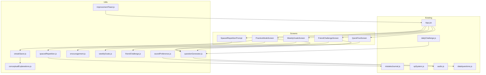

# Design Document: Student Engagement Enhancements

## Overview

This design covers 13 engagement features for Algebra Assault, a client-side React 18 educational math game. All features operate entirely in the browser using localStorage (via `window.storage`) with no backend. The enhancements target struggling students by reducing pressure, increasing variety, adding social motivation, and reinforcing retention.

The features fall into four categories:

1. **Low-Pressure Modes** — Practice Mode (Req 1), Quick Five (Req 9)
2. **Content Generation & Variety** — Procedural Question Generation (Req 2), Expanded Daily Challenge (Req 8), Conceptual Explanations (Req 12)
3. **Motivation & Retention** — Streak Saver (Req 3), Encouragement System (Req 4), Weekly Goals (Req 5), Friend Challenge (Req 6), Spaced Repetition (Req 7), Improvement Toasts (Req 10)
4. **Quality of Life** — Persist Sound Preference (Req 11), Cross-Platform Responsiveness (Req 13)

### Design Decisions

| Decision | Rationale |
|----------|-----------|
| New modules in `src/utils/` and `src/screens/` | Follows existing modular structure; avoids bloating App.jsx |
| Seeded PRNG for question generation | Enables deterministic Friend Challenge codes and reproducible daily challenges |
| Base64url encoding for challenge codes | URL-safe, compact, no special characters — easy to share via text |
| Spaced repetition intervals stored as timestamps | Simple comparison with `Date.now()` — no date library needed |
| Tailwind responsive utilities for cross-platform | Already in the stack; no additional CSS framework required |
| `fast-check` for property-based testing | Already installed as a dev dependency |

## Architecture



### Module Dependency Flow

- **App.jsx** orchestrates screen transitions and passes state/callbacks to new screens
- **questionGenerator.js** is consumed by Practice Mode, Quick Five, Friend Challenge, and Expanded Daily Challenge
- **streakSaver.js** monitors consecutive wrong answers across both shooter and practice modes
- **spacedRepetition.js** reads from the existing Mistake Journal and manages its own scheduling state
- **weeklyGoals.js** tracks objectives and cosmetic reward unlocks independently
- **friendChallenge.js** encodes/decodes challenge codes and regenerates question sets from seeds

## Components and Interfaces

### New Utility Modules

#### `src/utils/questionGenerator.js`

```javascript
/**
 * Generate a linear equation question procedurally.
 * @param {string} topic - Topic key (e.g., 'linear')
 * @param {'easy'|'medium'|'hard'} difficulty - Difficulty tier
 * @param {function} rng - Seeded PRNG function returning [0,1)
 * @returns {{ q: string, a: string, wrong: string[], hint: string, steps: string[], conceptual: string }}
 */
export function generateQuestion(topic, difficulty, rng);

/**
 * Generate N unique questions for a session, avoiding repeats.
 * @param {string} topic - Topic key
 * @param {'easy'|'medium'|'hard'} difficulty - Difficulty tier
 * @param {number} count - Number of questions to generate
 * @param {number} seed - Numeric seed for PRNG
 * @returns {Array} Array of question objects
 */
export function generateQuestionSet(topic, difficulty, count, seed);

/**
 * Solve a generated linear equation string and return the solution.
 * Used internally for verification and distractor generation.
 * @param {string} equationStr - e.g., "3x + 5 = 14"
 * @returns {string} Solution string e.g., "x = 3"
 */
export function solveLinearEquation(equationStr);

/**
 * Create a seeded mulberry32 PRNG.
 * @param {number} seed
 * @returns {function} RNG function returning [0,1)
 */
export function createRNG(seed);
```

#### `src/utils/streakSaver.js`

```javascript
/**
 * Track consecutive wrong answers and determine if intervention is needed.
 * @param {object} state - { consecutiveWrong: number }
 * @param {boolean} correct - Whether the latest answer was correct
 * @returns {{ newState: object, shouldActivate: boolean }}
 */
export function updateStreakSaver(state, correct);

/**
 * Reset the streak saver state after intervention.
 * @returns {object} Fresh state { consecutiveWrong: 0 }
 */
export function resetStreakSaver();

/** Threshold for activation */
export const STREAK_THRESHOLD = 3;
```

#### `src/utils/encouragement.js`

```javascript
/**
 * Get a random motivational message, avoiding consecutive repeats.
 * @param {string|null} lastMessageId - ID of the previously shown message
 * @returns {{ id: string, text: string }}
 */
export function getEncouragementMessage(lastMessageId);

/**
 * Get a "comeback" message for recovering from a wrong streak.
 * @returns {{ id: string, text: string }}
 */
export function getComebackMessage();

/**
 * Get a streak celebration message.
 * @param {number} streakLength - Current correct streak length
 * @returns {{ id: string, text: string }}
 */
export function getStreakCelebration(streakLength);

/** Pool of at least 20 unique motivational messages */
export const ENCOURAGEMENT_POOL;
```

#### `src/utils/weeklyGoals.js`

```javascript
/**
 * Load weekly goal state from storage.
 * @returns {Promise<object>} { weekStart, objectives, progress, unlockedRewards }
 */
export async function loadWeeklyGoals();

/**
 * Check if the current week has reset and initialize new objectives if needed.
 * @param {object} state - Current weekly goal state
 * @returns {object} Updated state (may have reset progress)
 */
export function checkWeekReset(state);

/**
 * Update progress toward weekly objectives.
 * @param {object} state - Current state
 * @param {'questionsCorrect'|'sessionsStarted'|'dailyChallengesCompleted'} action
 * @param {number} amount - Increment amount
 * @returns {object} Updated state
 */
export function updateGoalProgress(state, action, amount);

/**
 * Check if all objectives are complete and award reward.
 * @param {object} state - Current state
 * @returns {{ completed: boolean, reward: object|null, newState: object }}
 */
export function checkGoalCompletion(state);

/** 12 cosmetic rewards (ship skins + trail colors) */
export const COSMETIC_REWARDS;

/**
 * Get the Monday midnight timestamp for the current week.
 * @returns {string} ISO date string of this week's Monday
 */
export function getCurrentWeekStart();
```

#### `src/utils/friendChallenge.js`

```javascript
/**
 * Encode challenge parameters into a URL-safe code (≤30 chars).
 * @param {{ topic: string, difficulty: string, seed: number, score: number }} params
 * @returns {string} Challenge code
 */
export function encodeChallenge(params);

/**
 * Decode a challenge code back into parameters.
 * @param {string} code - The challenge code string
 * @returns {{ topic: string, difficulty: string, seed: number, score: number } | null}
 *   Returns null if code is invalid/corrupted
 */
export function decodeChallenge(code);

/**
 * Validate that a challenge code is structurally valid.
 * @param {string} code
 * @returns {boolean}
 */
export function isValidChallengeCode(code);
```

#### `src/utils/spacedRepetition.js`

```javascript
/**
 * Load spaced repetition schedule from storage.
 * @returns {Promise<Array>} Array of { questionKey, nextReview, interval, topic }
 */
export async function loadSchedule();

/**
 * Save spaced repetition schedule to storage.
 * @param {Array} schedule
 */
export async function saveSchedule(schedule);

/**
 * Schedule a new mistake for spaced repetition (interval = 1 day).
 * @param {object} mistake - Mistake journal entry
 * @returns {object} Schedule entry
 */
export function scheduleNewMistake(mistake);

/**
 * Advance interval after correct review answer.
 * Intervals: 1 day → 3 days → 7 days → resolved
 * @param {object} entry - Schedule entry
 * @returns {object|null} Updated entry, or null if resolved
 */
export function advanceInterval(entry);

/**
 * Reset interval after incorrect review answer (back to 1 day).
 * @param {object} entry - Schedule entry
 * @returns {object} Updated entry with interval reset
 */
export function resetInterval(entry);

/**
 * Get all questions due for review (nextReview <= now).
 * @param {Array} schedule - Full schedule
 * @param {number} now - Current timestamp (Date.now())
 * @returns {Array} Due entries
 */
export function getDueQuestions(schedule, now);

/** Interval stages in milliseconds */
export const INTERVALS = {
  stage1: 1 * 24 * 60 * 60 * 1000,  // 1 day
  stage2: 3 * 24 * 60 * 60 * 1000,  // 3 days
  stage3: 7 * 24 * 60 * 60 * 1000,  // 7 days
};
```

#### `src/utils/improvementToast.js`

```javascript
/**
 * Check if the student's accuracy has improved enough to show a toast.
 * Compares current rolling average (last 10 questions) to previous.
 * @param {object} progressData - { perTopicAccuracy, previousRollingAvg }
 * @param {string} topic - Topic key
 * @param {number} currentAccuracy - Current rolling accuracy (0-100)
 * @returns {{ show: boolean, message: string, type: 'accuracy'|'streak' }}
 */
export function checkImprovementToast(progressData, topic, currentAccuracy);

/**
 * Check if a new personal best streak was achieved.
 * @param {number} currentStreak - Current streak
 * @param {number} previousBest - Previous best streak for topic
 * @returns {{ show: boolean, message: string }}
 */
export function checkStreakRecord(currentStreak, previousBest);
```

#### `src/utils/soundPreference.js`

```javascript
/**
 * Load sound preference from storage.
 * @returns {Promise<boolean>} true = sound enabled, false = muted
 */
export async function loadSoundPreference();

/**
 * Save sound preference to storage.
 * @param {boolean} enabled
 */
export async function saveSoundPreference(enabled);
```

#### `src/utils/conceptualExplanations.js`

```javascript
/**
 * Get the conceptual explanation for a given algebraic technique.
 * @param {string} technique - e.g., 'isolating-variables', 'expanding-brackets'
 * @returns {string|null} Explanation text, or null if unavailable
 */
export function getConceptualExplanation(technique);

/**
 * Map a question to its primary algebraic technique.
 * @param {object} question - Question object with q, topic, difficulty
 * @returns {string} Technique key
 */
export function identifyTechnique(question);

/** Supported techniques with explanations */
export const TECHNIQUES;
```

### New Screen Components

#### `src/screens/PracticeModeScreen.jsx`

- Topic selector (or "mixed" option)
- Single question display with 4 answer options
- Full step-by-step solution reveal on answer
- Conceptual explanation display on wrong answers
- Streak saver integration (activates after 3 wrong)
- Encouragement messages on wrong answers
- XP award at 50% rate
- Exit button always visible
- Responsive layout (single-column on mobile)

#### `src/screens/QuickFiveScreen.jsx`

- 5 random questions from all topics
- Progress indicator (1/5, 2/5, etc.)
- Summary screen at end (correct count, XP, accuracy %)
- Standard XP awards
- No timer, no shooter gameplay
- Responsive layout

#### `src/screens/FriendChallengeScreen.jsx`

- Two sub-views: "Create Challenge" and "Enter Code"
- Create: complete questions → generate code → display/copy
- Enter: input field → validate → play same questions → compare scores
- Error handling for invalid codes
- Responsive layout

#### `src/screens/WeeklyGoalsScreen.jsx`

- Progress bars for each objective
- Countdown to weekly reset
- Unlocked cosmetic rewards gallery
- Current week's reward preview

#### `src/components/SpacedRepetitionPrompt.jsx`

- Modal/overlay shown on game load when reviews are due
- "Review Now" and "Skip" options
- Question display with answer feedback
- Interval advancement on correct/incorrect

#### `src/components/ImprovementToast.jsx`

- Fixed-position toast notification
- Auto-dismiss after 4 seconds
- Non-blocking (pointer-events: none on container)
- Slide-in animation (respects reduced motion)

#### `src/components/EncouragementBanner.jsx`

- Inline message below answer feedback
- Displays motivational text
- Comeback and streak celebration variants

### Modified Existing Modules

#### `src/utils/dailyChallenge.js` (Enhanced)

- `getDailyQuestions()` updated to return 7 questions from 3+ topics
- Difficulty mix: 2 easy, 3 medium, 2 hard
- Maintains date-seeded deterministic selection
- Falls back to `questionGenerator.js` if static bank is insufficient

#### `src/audio.js` (Modified)

- On module load, check `soundPreference.js` before creating AudioContext
- Block all playback until preference is loaded

#### `src/App.jsx` (Modified)

- Add screen routing for new screens
- Integrate streak saver state tracking
- Integrate improvement toast trigger logic
- Load sound preference on mount (before any audio)
- Add weekly goals progress tracking hooks

## Data Models

### Storage Keys (all via `window.storage`)

| Key | Shape | Purpose |
|-----|-------|---------|
| `matteo-sound-pref` | `{ enabled: boolean }` | Sound on/off preference |
| `matteo-weekly-goals` | `WeeklyGoalState` | Weekly objectives + progress |
| `matteo-cosmetic-rewards` | `{ unlocked: string[] }` | Unlocked ship skins/trails |
| `matteo-spaced-rep` | `SpacedRepSchedule[]` | Spaced repetition schedule |
| `matteo-streak-saver` | `{ consecutiveWrong: number }` | Per-session streak counter |
| `matteo-improvement` | `{ rollingAvg: object, bestStreaks: object }` | Rolling accuracy + best streaks per topic |

### Data Structures

```javascript
// Weekly Goal State
{
  weekStart: "2024-01-15",          // Monday ISO date
  objectives: {
    questionsCorrect: { target: 50, current: 0 },
    sessionsStarted: { target: 5, current: 0 },
    dailyChallengesCompleted: { target: 3, current: 0 }
  },
  unlockedRewards: ["skin-nebula", "trail-gold"],
  currentRewardIndex: 2             // Next reward to unlock
}

// Spaced Repetition Schedule Entry
{
  questionKey: "linear-medium-3x+5=14",  // Unique identifier
  topic: "linear",
  question: { q, a, wrong, hint, steps },
  nextReview: 1705420800000,             // Timestamp
  interval: "stage1",                     // stage1 | stage2 | stage3
  addedAt: 1705334400000
}

// Cosmetic Reward Definition
{
  id: "skin-nebula",
  name: "Nebula Ship",
  type: "skin",                    // "skin" | "trail"
  color: "#8b5cf6",                // Primary color for rendering
  unlockWeek: 1                    // Which week number unlocks this
}

// Challenge Code Encoded Data
{
  topic: "linear",                 // 3-bit topic index
  difficulty: "medium",            // 2-bit difficulty
  seed: 42857,                     // 16-bit seed
  score: 450                       // 12-bit score (max 4095)
}

// Generated Question (extends existing format)
{
  q: "3x + 5 = 14",
  a: "x = 3",
  wrong: ["x = 6", "x = 19", "x = -3"],
  hint: "Subtract 5, then divide by 3",
  steps: ["Subtract 5 from both sides → 3x = 9", "Divide by 3 → x = 3"],
  conceptual: "isolating-variables",   // Technique key for explanation lookup
  generated: true                       // Flag to distinguish from static bank
}

// Improvement Toast Event
{
  type: "accuracy" | "streak",
  topic: "linear",
  message: "Your linear equations accuracy improved by 15%!",
  timestamp: 1705420800000
}

// Encouragement Message
{
  id: "enc-01",
  text: "Mistakes are proof you're trying. Keep going!",
  category: "general" | "comeback" | "streak"
}
```

### Question Generator Coefficient Ranges

| Difficulty | Coefficient Range | Constant Range | Equation Forms |
|-----------|-------------------|----------------|----------------|
| Easy | 1–5 | 1–20 | `ax + b = c` |
| Medium | 1–8 | -15 to 30 | `ax + b = cx + d`, `a(x + b) = c` |
| Hard | 1–10 | -20 to 40 | `a(bx + c) = d(ex + f)`, fractions |

### Distractor Generation Strategy

Distractors are derived from common student mistakes:
1. **Sign error**: Negate the correct answer
2. **Operation error**: Add instead of subtract (or vice versa)
3. **Coefficient error**: Forget to divide by the leading coefficient
4. **Random plausible**: Correct answer ± small random offset

## Correctness Properties

*A property is a characteristic or behavior that should hold true across all valid executions of a system — essentially, a formal statement about what the system should do. Properties serve as the bridge between human-readable specifications and machine-verifiable correctness guarantees.*

### Property 1: Question generation round-trip correctness

*For any* generated question (any topic, any difficulty tier, any seed), independently parsing the equation string and solving it algebraically SHALL yield the same answer as the stated correct answer field.

**Validates: Requirements 2.6**

### Property 2: Generated question structural validity

*For any* generated question (any topic, any difficulty tier, any seed), the output SHALL have: exactly one correct answer string, exactly three distractor strings all distinct from each other and from the correct answer, a non-empty steps array, a non-empty conceptual technique key that maps to a known explanation, and all coefficients/constants within the defined ranges for that difficulty tier producing an integer or simple fractional solution.

**Validates: Requirements 2.1, 2.3, 2.4, 2.5, 12.3**

### Property 3: Question generation uniqueness

*For any* seed, topic, and difficulty tier, generating 200 questions SHALL produce 200 distinct equation strings with no duplicates.

**Validates: Requirements 2.2**

### Property 4: Challenge code encode/decode round-trip

*For any* valid challenge parameters (topic from the 6 playable topics, difficulty from easy/medium/hard, seed from 0–65535, score from 0–4095), encoding then decoding SHALL return the original parameters, the encoded string SHALL be URL-safe (matching `/^[A-Za-z0-9_-]+$/`), and the encoded string SHALL be 30 characters or fewer.

**Validates: Requirements 6.1, 6.2**

### Property 5: Challenge code deterministic question regeneration

*For any* valid challenge code, decoding it and using the extracted seed to generate questions SHALL produce the exact same question set (same equations, same order, same options) every time.

**Validates: Requirements 6.3**

### Property 6: Challenge code validation

*For any* string that is NOT a valid encoding (random strings, truncated codes, codes with invalid characters), `decodeChallenge` SHALL return null. *For any* string produced by `encodeChallenge` with valid parameters, `decodeChallenge` SHALL return non-null.

**Validates: Requirements 6.5**

### Property 7: Streak saver state machine

*For any* sequence of correct/incorrect answers, the streak saver SHALL activate if and only if the sequence contains 3 consecutive incorrect answers since the last reset. After activation, the consecutive-wrong counter SHALL be zero regardless of which intervention option is chosen.

**Validates: Requirements 3.1, 3.5**

### Property 8: Streak saver difficulty reduction

*For any* question at medium or hard difficulty, when the streak saver activates and the student chooses "easier version," the replacement question SHALL be at exactly one difficulty tier lower (hard→medium, medium→easy).

**Validates: Requirements 3.3**

### Property 9: Encouragement message selection

*For any* sequence of wrong-answer events, the encouragement system SHALL return a non-empty message from a pool of at least 20, and no two consecutive calls with the same `lastMessageId` SHALL return the same message.

**Validates: Requirements 4.1, 4.2**

### Property 10: Comeback and streak celebration triggers

*For any* correct answer that follows a streak of 1+ wrong answers, the system SHALL return a comeback-category message. *For any* correct-answer streak of length >= 5, the system SHALL return a streak celebration message.

**Validates: Requirements 4.3, 4.5**

### Property 11: Practice mode answer effects

*For any* question answered in Practice Mode: if incorrect, HP and score SHALL remain unchanged; if correct, XP awarded SHALL equal exactly 50% of the standard XP rate (rounded down). In all cases, feedback SHALL include correctness status and step-by-step solution.

**Validates: Requirements 1.2, 1.3, 1.6**

### Property 12: Spaced repetition interval progression

*For any* schedule entry: `scheduleNewMistake` SHALL set nextReview to now + 1 day (stage1). `advanceInterval` on a stage1 entry SHALL produce stage2 (now + 3 days). `advanceInterval` on stage2 SHALL produce stage3 (now + 7 days). `advanceInterval` on stage3 SHALL return null (resolved). `resetInterval` on any stage SHALL return stage1 (now + 1 day).

**Validates: Requirements 7.1, 7.2, 7.3**

### Property 13: Due questions retrieval

*For any* schedule array and timestamp `now`, `getDueQuestions` SHALL return exactly those entries where `entry.nextReview <= now`, and SHALL NOT return entries where `entry.nextReview > now`.

**Validates: Requirements 7.4**

### Property 14: Expanded daily challenge composition

*For any* date string, `getDailyQuestions` SHALL return exactly 7 questions drawn from at least 3 distinct topics, with at least 2 easy, 3 medium, and 2 hard questions. Calling the function twice with the same date string SHALL return identical results.

**Validates: Requirements 8.1, 8.2, 8.3**

### Property 15: Weekly goal reset on new week

*For any* state with a `weekStart` that is in a previous week relative to the current Monday, `checkWeekReset` SHALL clear all progress counters to zero and update `weekStart` to the current Monday.

**Validates: Requirements 5.1**

### Property 16: Weekly goal completion and reward

*For any* weekly goal state where all objectives have `current >= target` and unlocked rewards < 12, `checkGoalCompletion` SHALL return `completed: true` with a new reward. *For any* state where all 12 rewards are already unlocked and objectives are complete, it SHALL award bonus XP instead of a reward.

**Validates: Requirements 5.3, 5.5**

### Property 17: Improvement detection

*For any* topic where the current 10-question rolling accuracy exceeds the previous rolling average by 10+ percentage points, `checkImprovementToast` SHALL return `show: true`. *For any* current streak that exceeds the previous best streak for that topic, `checkStreakRecord` SHALL return `show: true`.

**Validates: Requirements 10.1, 10.2**

### Property 18: Quick Five session summary

*For any* set of 5 answers (each correct or incorrect), the Quick Five summary SHALL report: correct count equal to the number of correct answers, accuracy equal to (correct/5)*100, and XP earned equal to correctCount × standard XP rate.

**Validates: Requirements 9.1, 9.3, 9.4**

## Error Handling

| Scenario | Handling Strategy |
|----------|-------------------|
| `window.storage.get/set` fails | Graceful degradation — feature continues with in-memory state; no crash |
| Invalid challenge code entered | `decodeChallenge` returns null → UI shows "Invalid code" message, allows retry |
| Question generator produces duplicate | Retry with incremented seed offset (up to 10 retries) |
| Spaced repetition schedule corrupted in storage | Reset to empty schedule; log warning to console |
| Weekly goals state corrupted | Reset to fresh state with current week start |
| Sound preference load fails | Default to sound enabled (Req 11.3) |
| Conceptual explanation unavailable for a technique | Omit the "Why this works" section; still show procedural steps (Req 12.1) |
| Daily challenge cannot find 3+ topics with enough questions | Fall back to question generator to fill gaps |
| Rolling average has < 10 questions for a topic | Skip improvement toast for that topic until threshold met |

### Defensive Patterns

- All `window.storage` calls wrapped in try/catch with fallback values
- All user-facing inputs (challenge codes) validated before processing
- State transitions use pure functions that return new state (no mutation)
- Toast notifications use `setTimeout` with cleanup on unmount to prevent memory leaks
- Weekly goal date comparisons use UTC-normalized Monday boundaries to avoid timezone edge cases

## Testing Strategy

### Property-Based Tests (using `fast-check`)

The project already has `fast-check` installed. Each property test runs a minimum of 100 iterations and is tagged with its design property reference.

| Property | Module Under Test | Generator Strategy |
|----------|-------------------|-------------------|
| 1: Round-trip correctness | `questionGenerator.js` | Random seeds × topics × difficulties |
| 2: Structural validity | `questionGenerator.js` | Random seeds × topics × difficulties |
| 3: Uniqueness (200) | `questionGenerator.js` | Random seeds × topics × difficulties |
| 4: Challenge encode/decode | `friendChallenge.js` | Random topics, difficulties, seeds (0–65535), scores (0–4095) |
| 5: Deterministic regeneration | `friendChallenge.js` + `questionGenerator.js` | Random valid challenge codes |
| 6: Code validation | `friendChallenge.js` | Random ASCII strings (invalid) + encoded codes (valid) |
| 7: Streak saver state machine | `streakSaver.js` | Random boolean sequences (correct/incorrect) |
| 8: Difficulty reduction | `streakSaver.js` + `questionGenerator.js` | Random questions at medium/hard |
| 9: Encouragement selection | `encouragement.js` | Random sequences of lastMessageId values |
| 10: Comeback/celebration triggers | `encouragement.js` | Random streak lengths |
| 11: Practice mode effects | Integration | Random questions × answers |
| 12: Interval progression | `spacedRepetition.js` | Random timestamps × stages |
| 13: Due questions | `spacedRepetition.js` | Random schedules × timestamps |
| 14: Daily challenge composition | `dailyChallenge.js` | Random date strings (YYYY-MM-DD) |
| 15: Weekly reset | `weeklyGoals.js` | Random date pairs across week boundaries |
| 16: Goal completion | `weeklyGoals.js` | Random objective states |
| 17: Improvement detection | `improvementToast.js` | Random accuracy pairs × streak pairs |
| 18: Quick Five summary | Integration | Random 5-answer boolean arrays |

**Tag format**: `// Feature: student-engagement-enhancements, Property N: <title>`

**Configuration**: Each test uses `fc.assert(fc.property(...), { numRuns: 100 })`

### Unit Tests (example-based)

| Area | Tests |
|------|-------|
| Practice Mode UI | Renders without canvas/HP/timer; topic selector works; exit returns to menu |
| Streak Saver UI | Offers two options on activation; explanation displays correctly |
| Weekly Goals UI | Progress bars render; countdown displays |
| Friend Challenge UI | Code display/copy; score comparison layout |
| Toast component | Auto-dismisses after 4s; non-blocking positioning |
| Sound preference | Persists on toggle; blocks audio until loaded; defaults to enabled |
| Keyboard shortcuts | Number keys 1-4 select answers in new screens |
| Touch input | Touch events trigger answer selection |
| Responsive layout | Single-column at <640px; 44px tap targets |

### Integration Tests

| Area | Tests |
|------|-------|
| Question generator + static bank | Generated questions used when bank exhausted |
| Spaced repetition + mistake journal | Mistakes flow into schedule correctly |
| Weekly goals + XP system | XP awarded on goal completion |
| Daily challenge expansion | 7 questions returned with correct mix |
| Streak saver in both modes | Triggers in shooter and practice mode |

### Test Commands

```bash
npm run test          # Runs all tests (vitest --run)
```

All new test files follow the existing pattern: `src/utils/<module>.test.js` and `src/screens/<screen>.test.jsx`.

